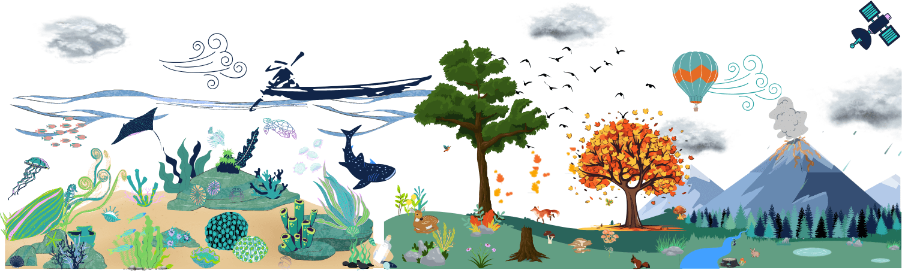

> <agenda-title></agenda-title>
>
> In this tutorial, we will cover:
>
> 1. TOC
> {:toc}
>
{: .agenda}

# 🌍 Introduction to the Earth System

The **Earth System** is a dynamic and interconnected network of components—**atmosphere, hydrosphere (ocean), geosphere (solid earth), biosphere (biodiversity), and continental surfaces (land)**—that interact to shape our planet’s climate, weather, and life. Understanding these interactions is critical for addressing global challenges like climate change, biodiversity loss, and natural disasters.

## Why Study the Earth System?

- **Climate Change**: Monitor and predict impacts on temperature, sea levels, and extreme weather.
- **Biodiversity**: Track ecosystems and species to protect natural habitats.
- **Natural Resources**: Manage water, soil, and minerals sustainably.
- **Human Health**: Understand air quality, pollution, and disease vectors.

## 🔗 Join the Conversation

Connect with the community and ask questions in our **[Matrix Channel](https://matrix.to/#/#galaxy-earth-system:matrix.org)**.  
Explore visualizations and datasets in our **[Earth System Dashboard](https://earth-system.usegalaxy.eu/)**.

## 🌎 European and French Subdomains

The **Galaxy Earth System** platform includes two dedicated spaces for regional analysis:

- **🇪🇺 [Earth System European Subdomain](https://earth-system.usegalaxy.eu/)**  
The **original subdomain**, fully operational and designed to:
  - Enable **cross-border collaboration** on Earth System research.
  - Provide **high-resolution datasets** for Europe.
- **🇫🇷 [Earth System French Lab](https://earth-system.usegalaxy.fr/)**  
A **test environment** to prove the feasibility of a dedicated subdomain.
  - Acts as a **proof of concept** for thematical Galaxy Labs.
  - **Interactive tools are currently not working** on this instance.
  - Aims to **replicate the model** for other Galaxy instances in the future.

## 📚 Learning Pathway: Building the European Subdomain

Discover how we created the **European subdomain** on Galaxy in our dedicated **[Learning Pathway](  )**. This pathway covers:

- Set up your subdomain for your community.
- Build a batch tool.
- Build an interactive tool.

# 🌐 Climate and Ecology: Strongly Linked Themes

Climate and ecology are **inextricably linked**:

- **Climate** drives ecological processes (e.g., temperature affects species distribution).
- **Ecology** influences climate (e.g., forests absorb CO₂, oceans regulate heat).

On Galaxy, you can explore these connections through:

- **Climate Data**: ERA5 reanalysis, Sentinel-5P atmospheric data.
- **Ecological Data**: OBIS biodiversity records, Sentinel-2 land cover.
- **Integrated Workflows**: Combine climate and ecological datasets to study impacts like habitat loss or carbon cycles.

## 📚 Learn More

- [Climate 101 Tutorial](  ): Introduction to climate science and data.
- [Climate Subdomain](https://climate.usegalaxy.eu/): Dedicated platform for climate data and analysis.
- [Ecology Subdomain](https://ecology.usegalaxy.eu/): Dedicated platform for ecological data and analysis.

💬 **Discuss these links in our [Matrix Channel](https://matrix.to/#/#galaxy-earth-system:matrix.org)**!

# 🗂️ Explore Earth System Components

Choose which Earth System component you want to explore:  
**Ocean, Atmosphere, Land, Geosphere (Solid Earth), or Biodiversity**.



## 🌊 Ocean 🌊

The ocean is a key component of the Earth’s climate system. It requires continuous real-time monitoring to help scientists better understand its dynamics and predict its evolution.

### On Galaxy 

🌊 Teaser: Dive into Ocean Data with Galaxy!

Ever wondered how scientists monitor the **hidden world beneath the waves**? With Galaxy, you can explore **real-time ocean data** from global networks like **Argo**, **Copernicus Sentinel-3**, and **EMODnet Chemistry** to study:
- Ocean currents and temperature (Argo floats).
- Sea surface topography and color (Sentinel-3).
- Marine chemistry and pollutants (EMODnet).
- Climate impacts on marine ecosystems (Copernicus Marine Data Store).
- Nitrate calibration and quality control for Argo floats.

👉[Start your ocean data journey here](  ) and discover how to analyze and visualize ocean data with Galaxy!

## ☁️ Atmosphere 🌫️

The atmosphere is the layer of gas around the Earth, critical for regulating climate and weather.

### On Galaxy 

☁️ Teaser: Explore the Atmosphere and Its Climate Connections with Galaxy!

How do scientists monitor the **invisible layer of gas** that surrounds our planet and drives our climate? With Galaxy, you can dive into **atmospheric data** from **Sentinel-5P** and **ERA5** to study:

- **Atmospheric composition** (e.g., SO₂, NO₂, O₃, aerosol index) and its impact on climate
- **Volcanic activity** (e.g., La Soufrière eruption in the Antilles) and its climate effects
- **Climate reanalysis** (e.g., ERA5 hourly data for past and present climate studies)

💡 **New to atmospheric or climate data?** Our [Where to Start with Atmosphere Data in Galaxy tutorial](  ) offer comprehensive guidance!

## 🏜️ Land 🏞️

Land includes solid Earth, soil, and surface processes like erosion, desertification, and climate change impacts.

### On Galaxy

🏜️ Teaser: Explore Land Data and Its Climate Connections with Galaxy!

How do scientists monitor the **solid surface of our planet** and its interactions with climate? With Galaxy, you can dive into **land data** from **Sentinel-2**, **QGIS**, and **FATES** to study:

- **Land surface changes** (erosion, desertification, urbanization)
- **Vegetation health** using NDVI and other spectral indices
- **Land-atmosphere interactions** that influence climate
- **Ecosystem modeling** with FATES to understand climate impacts

💡 **New to land or climate data?** Our [Where to Start with Land Data in Galaxy tutorial](  ) offer comprehensive guidance!

## 🌋 Geosphere (Solid Earth)

The geosphere includes Earth's rocks, minerals, and tectonic processes.

### On Galaxy
- **Seismic and Volcanic Data**: Monitor earthquakes, volcanic eruptions, and tectonic activity.
- **Geodetic Data**: Measure Earth’s shape, gravity, and crustal movements.
- **Tool**: [QGIS Galaxy Interactive Tool](https://usegalaxy.eu/root?tool_id=interactive_tool_qgis) (for geological maps).

 

## 🐙 Biodiversity 🐿️

Biodiversity encompasses all living organisms in the ocean, atmosphere, and land.

### On Galaxy

🐙 Teaser: Explore Biodiversity with Galaxy!

Biodiversity is the **web of life** that connects land, ocean, and atmosphere. With Galaxy, you can:
- **Analyze marine biodiversity** using OBIS data and metagenomics tools.
- **Study terrestrial species** with GBIF's billion-record database.
- **Visualize biodiversity patterns** and their environmental correlations.

🔹 **For a deep dive into biodiversity analysis**, start with the **[Intro to Galaxy and Ecology Learning Pathway )**—your gateway to Galaxy's biodiversity tools and workflows.

🔹 **Explore specific datasets**:
- [OBIS Marine Indicators Tutorial](  )
- [Cleaning GBIF Data Tutorial](  )

## 🔗 Cross-Domain Connections

Biodiversity data spans **land, ocean, and atmosphere**. The following tools are **also listed in their respective domain pages**:

🔹 **Access tools**:
- 
* Also listed in [Where to start with ocean data in galaxy](  )*
- 
* Also listed in [Where to start with ocean data in galaxy](  )*

💡 **New to biodiversity data?** The **[Ecology Subdomain](https://ecology.usegalaxy.eu/)** is your one-stop shop for all things biodiversity in Galaxy!

# 🌟 Conclusion and Next Steps

This tutorial introduced the **Earth System** and its five key components, with a focus on **European/French subdomains** and the **links between climate and ecology**. Each component has dedicated trainings, tools, and workflows on Galaxy to help you explore further.

## 🔜 What’s Next?

- **More Tutorials**: Stay tuned for new trainings on Earth System data and analysis!
- **Community**: Join our **[Matrix Channel](https://matrix.to/#/#galaxy-earth-system:matrix.org)** to share ideas and get support.
- **Feedback**: Help us improve by contributing to the **[Galaxy Training Network](https://training.galaxyproject.org/)**.

## Extra information

Coming up soon even more tutorials on and other Earth-System related trainings. Keep an  open if you are interested!

🌟
