# How to run Easy Q.C.V BGC on Galaxy

The next sections explain how to qualify and calibrate the nitrate sensor mounted on the Argo float **4903881** either tool by tool or by running a pre-defined Galaxy workflow.  
This requires two preliminary steps to prepare the environment.

For your information, execution time for running tools depends on the number of files, their size and/or the number of people working on Galaxy.

> <warning-title>Do not change file name</warning-title>
> DO NOT change file names to ensure that any changes you make with ODV will be carried over. However, it is possible to change the name of galaxy collections to make them easier to find.
{: .warning}



> <agenda-title></agenda-title>
>
> In this tutorial, we will cover:
>
> 1. TOC
> {:toc}
>
{: .agenda}

# Prerequisites

## Galaxy 
> <details-title>Galaxy account</details-title>
> Create or login to your [Galaxy Europe account](https://earth-system.usegalaxy.eu/login/start).
{: .details}

> <details-title>Galaxy tips and tricks</details-title>
> Once you are logged in, Galaxy is divided into 4 vertical panels:
> - Far left: **Galaxy action list** (Upload, Tools, Interactive Tools…)
> - Center: **Main panel**
> - Far right: **History** section
>
> 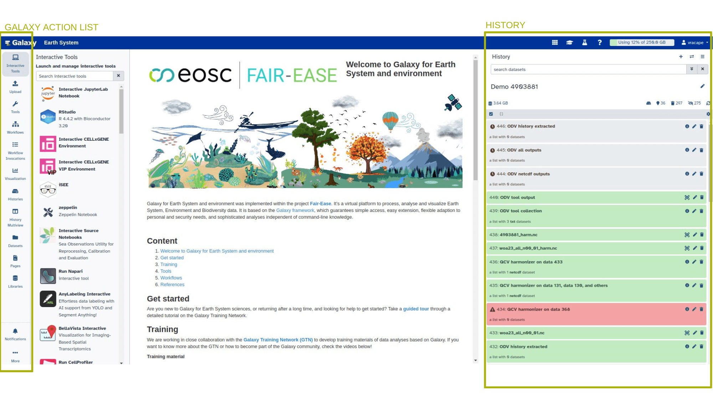
>
> All symbols have a tooltip when you hover them. These names will be indicated with *{}* in this tutorial.
>
> The history section stores all your job results with the following color code:
> - Grey = cancelled
> - Orange = running
> - Green = finished with success
> - Red = failed
>
> It is possible to organise your history with sub-directories:
> - **New history**: click on **+** at the top-right of history, edit the name with the pencil, save
> - **Switch history**: click on the **⇄** icon and select a history
> - **Copy datasets**: click on **Operations** → *Copy datasets* and choose source/destination histories
>
> 
{: .details}

> <details-title>Galaxy execution constraints</details-title>
> - **Quota per user account**: check [your quota](https://galaxyproject.org/support/account-quotas/).  
> Free space by clicking the database icon in the history panel and “Review and clear” GB.  
> (Note: deleting a dataset in the history does not free quota until you purge it.)
> 
> 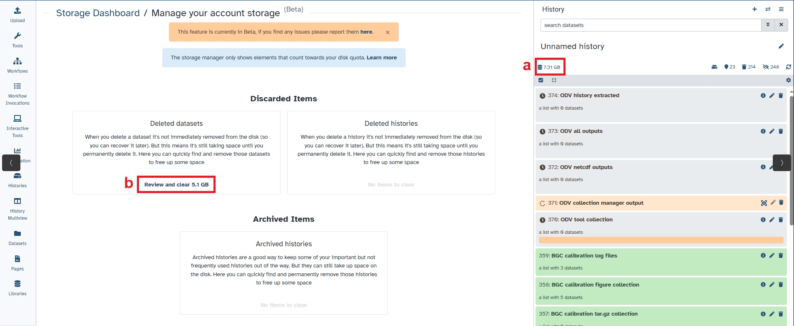
> 
> - **Time limit for interactive tools**: 24h. After that, ODV closes automatically.  
> - **Avoid weekends**: upgrades are performed and can stop tools/workflows.  
> - **Max interactive tools simultaneously**: 2.
{: .details}

## Nitrate calibration

> <comment-title>Oxygen prerequisite</comment-title>
> Because oxygen concentration is implied in the estimation of the *nitrate adjustment from neural network method*,  
> platforms to be calibrated must have **good-quality oxygen** (adjusted in real time or delayed mode for Argo floats or gliders).
{: .comment}

> <details-title>World Ocean Atlas reference</details-title>
> Nitrate calibration needs a potential reference dataset such as the **WOA annual climatology**.  
> You can [download it here](https://www.ncei.noaa.gov/thredds-ocean/catalog/woa23/DATA/nitrate/netcdf/all/1.00/catalog.html?dataset=woa23/DATA/nitrate/netcdf/all/1.00/woa23_all_n00_01.nc) and upload it into Galaxy.
{: .details}

# Manage your data

## Step 1: Get your data 

> <hands-on-title>Get your data from the S3 server</hands-on-title>
> - Click on **Upload** in the vertical panel on the left
> - In the pop-up window, click on **Choose from repository**
> - In the top search bar, search for `argo`
> - In the result list, select **Argo marine floats data and metadata from Global Data Assembly Centre (Argo GDAC)**
> - Navigate to `pub/dac/coriolis/4903881`
> - Tick the following:
>   - `4903881_meta.nc`
>   - All files under `profiles/`
> - Click on **Select** (bottom-right)
> - Remove the synthetic files `SR4903881_*.nc` (by clicking the trash icon)
> - Click on **Start**
> - Wait until all files are stored in your history on the right (green color)
>
> 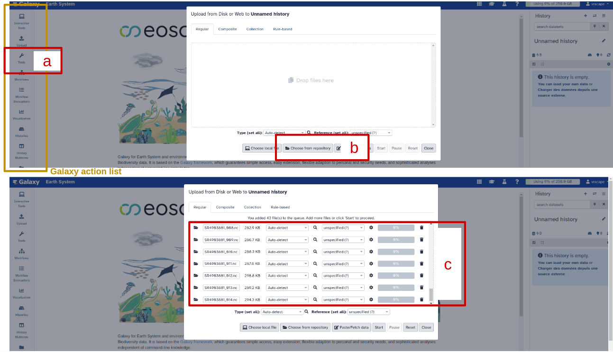
{: .hands_on}

> <hands-on-title>Get your data from your computer</hands-on-title>
> - Click on **Upload** in the vertical panel on the left
> - In the pop-up, click on **Choose local file**
> - Select the files on your system (Argo float or WOA)
> - Click on **Open** then **Start**
> - Wait until all files are stored in your history (green color)
>
> 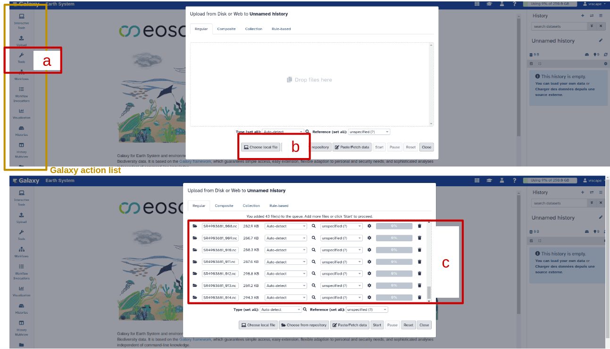
{: .hands_on}

## Step 2: Organize your data

> <hands-on-title>Create a dataset collection (from empty history)</hands-on-title>
> - Click on **Select item** at the top of the history panel
> - Click on **Select all** (now visible at the top right)
> - Click on **All ## selected**
> - Choose **Auto build list**
> - In the pop-up window:
>   - Set the name: `4903881`
>   - Turn off **Remove file extension**
>   - Click on **Build**
>
> Once the collection is created, all files turn green. You can limit visible files using the eye icons in the history panel.
>
> 
> 
{: .hands_on}

> <hands-on-title>Create a dataset collection (from non-empty history)</hands-on-title>
> - Click on **Select item**
> - Manually tick only the files of interest
> - Click on **## of ## selected**
> - Choose **Auto build list**
> - In the pop-up window:
>   - Set the name: `4903881`
>   - Turn off **Remove file extension**
>   - Click on **Build**
>
> 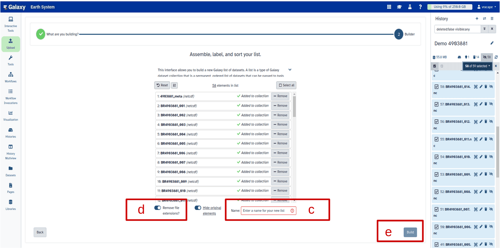
> 
{: .hands_on}

> <hands-on-title>Change file extension (for WOA file)</hands-on-title>
> - In the history panel, click on the **pencil icon** of the WOA NetCDF file
> - In the central panel, go to the **Datatype** tab
> - Set the **New type** to `NetCDF`
> - Click on **Save**
>
> 
{: .hands_on}

# Run a predefined workflow

> <hands-on-title>Run a public workflow</hands-on-title>
>
> - Click on **Workflows** on the vertical panel on the left of the **Galaxy action list**  
> - Click on **Public Workflows**  
> - Search for **Argo-Glider Nitrate QCV** (or others) in the top search bar  
> - Click on the workflow name: a pop-up window opens with a preview of the workflow  
> - To run it directly: click **Run** (top-right)  
> - **Recommended**: click **Import** (left of Run) to make your own local copy under *Workflows / My Workflows*  
> - When you click **Run**, a panel asks you for the input files:  
>   - Select the Argo files and climatology uploaded during the [data management phase](#manage-your-data)  
>   - Once filled in, click **Run** again  
>
> 
{: .hands_on}

## Workflow human in the loop

Now that your workflow is running, remember it contains both non-interactive and interactive steps. For the interactive tools (ODV), user action is required.

- When the workflow arrives at the **ODV interactive step for qualification**:  
  - Open ODV  
  - Apply QC following
  - Export history 

- Once the qualification step is finished and the history exported, close ODV. The workflow will then continue automatically.

- When the workflow arrives at the **ODV interactive step for validation**:  
  - Open ODV again  
  - Follow the validation phase as described in

> <tip-title>Copy pasting between computer and ODV</tip-title>
> Expand the ODV left panel (3 vertical dots) to access the clipboard. Paste text into ODV forms via this clipboard. Click outside the panel to collapse it.
>
> 
{: .tip}

> <tip-title>ODV - Disconnected</tip-title>
> If ODV becomes grey with the red banner *ODV - Disconnected*, refresh the tab.
{: .tip}

> <warning-title>ODV execution limit</warning-title>
> ODV has a 24h time limit. If you launch a workflow and wait longer than 1 day before opening ODV, the workflow will continue automatically without your qualification step.
{: .warning}

## Available public workflows

> <details-title>Argo-Glider Nitrate QCV</details-title>
> Workflow to perform **Qualification**, **Nitrate Calibration**, and **Validation** of one Argo float or one Glider.  
> Uses Neural Network + Climatology.  
> Copy it before running and adjust calibration parametrizations if necessary.
{: .details}

  
# Tool by tool

> <warning-title>Before starting</warning-title>
> Before running the QCV procedure tool by tool, be sure that your environment (see Prerequisites and Manage your data) is ready!
{: .warning}

## Harmonize your data

The original files must be pre-processed in order to use the same tools regardless of their origin. This is performed by the tool `QCV harmonizer`.

> <details-title>QCV harmonizer details</details-title>
>
> This tool:  
> - harmonizes vocabulary and format  
> - aggregates multiple files from the same platform into one single file  
>
> Its outputs:  
> - a single NetCDF file named `###_harm.nc` (since version 3.0)  
>
> This tool is currently operational for Argo floats, World Ocean Atlas, and Gliders.  
> It should be run as many times as there are datasets/platforms.  
{: .details}

> <hands-on-title>Run QCV harmonizer</hands-on-title>
> - Click on **Tools** just below **Upload** on the left panel
> - Search for **QCV harmonizer** in the search bar
> - Select the tool. Its configuration page opens.
>
>  with the following parameters:
> - In *Input the NetCDF data files*:
>   - If using a dataset collection (e.g. 4903881):  
>     Select **Dataset collection** → click on *Select Value* → choose *4903881*
>   - If using WOA:  
>     Select **Single dataset** → click on *Select Value* → choose *woa###.nc*
> - Click **Run**
>
> 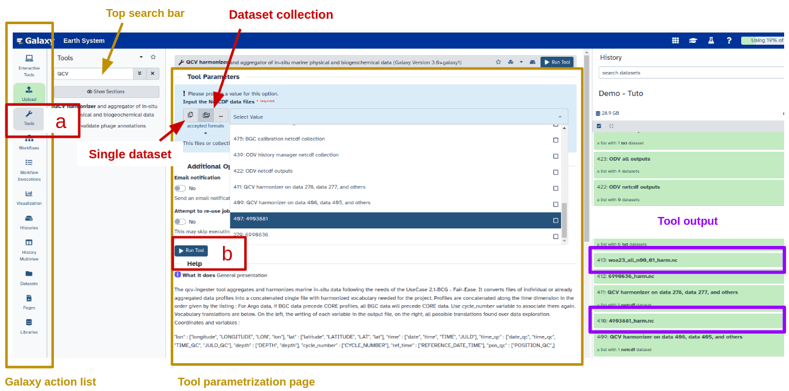
{: .hands_on}

> <details-title>Tip: drag and drop</details-title>
> If your file is not listed in the selection window, you can **drag and drop** it from the history panel into the *Select value* box.
{: .details}

## Qualify your data

### Step 1: Create the ODV collection

The visualization tools for the qualification, the validation and the extraction or reporting of the user actions include **ODV software**, the **ODV collection manager** and the **ODV history manager**.  

> <details-title>ODV collection manager details</details-title>
>
> This tool creates:  
> - ODV spreadsheet collections from harmonized file(s)  
> - ODV view for nitrate qualification  
>
> Capabilities:  
> - maps input QC flags with expected output QC flag scale  
> - subsets reference datasets (option: 1=subset, 0=no, -1=inverse)  
>
> Default parameters:  
> - operator name = anonymous  
> - QC convention = ARGO QC flag scale  
> - Subsetting = 1 (yes, even if no reference data)  
> - plt = 0 (no plot)  
>
> Outputs:  
> - `odv_collection.txt`  
> - `qualification_startingPoint_nitrate.xview`  
> - log file (`YYYY-MM-DDTHHMM_galaxy_odv-coll-manager_QV.log`)  
{: .details}

> <hands-on-title>Run ODV collection manager</hands-on-title>
> - Click on **Tools** in the left panel
> - Search for **ODV collection manager**
> - Select the tool. Its configuration page opens
>
>  with the following parameters:
> - For *Input raw data*:
>   - Select **Multiple Datasets** → click *Select Value* → choose *4903881_harm.nc*
> - (Optional) Add a harmonized WOA reference dataset
> - (Optional) Change default parameters: operator name, QC convention, subsetting, plt
> - Click **Run**
>
> Outputs:  
> - ODV spreadsheet collection `odv_collection.txt`  
> - View `qualification_startingPoint_nitrate.xview`  
> - Log file with actions  
>
> 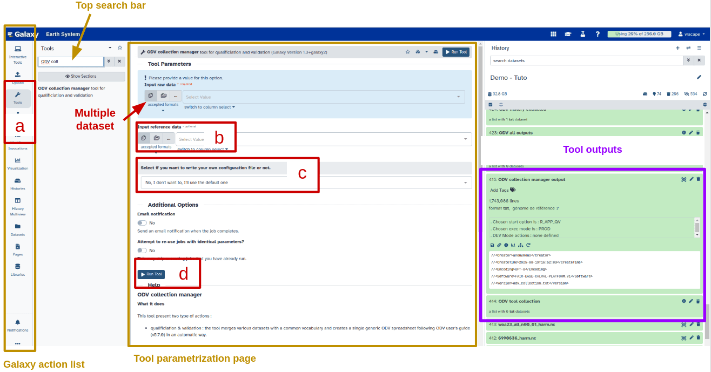
{: .hands_on}

### Step 2: Launch ODV automatically

> <details-title>ODV</details-title>
>
> ODV is a software for visualizing and/or qualifying scientific data.  
> It can be used locally or directly on the Galaxy .  
{: .details}

> <hands-on-title>Run ODV interactive tool</hands-on-title>
> - Click on **Tools** or **Interactive Tools** in the left panel
> - Search **ODV** interactive tool
> - Select the tool. Its configuration page opens
>
>  with the following parameters:
> - Ensure the tool version is **v5.8_1** (change via the 3 cubes on the left if needed)
> - Set parameters:
>   - *Load data automatically*: **Yes**
>   - *NetCDF or tabular text file*: select `ODV collection manager output` or drag and drop `odv_collection.txt`
>   - *Do you have a view?*: **Yes** → drag and drop `qualification_startingPoint_nitrate.xview`
> - Click **Run**
>
> 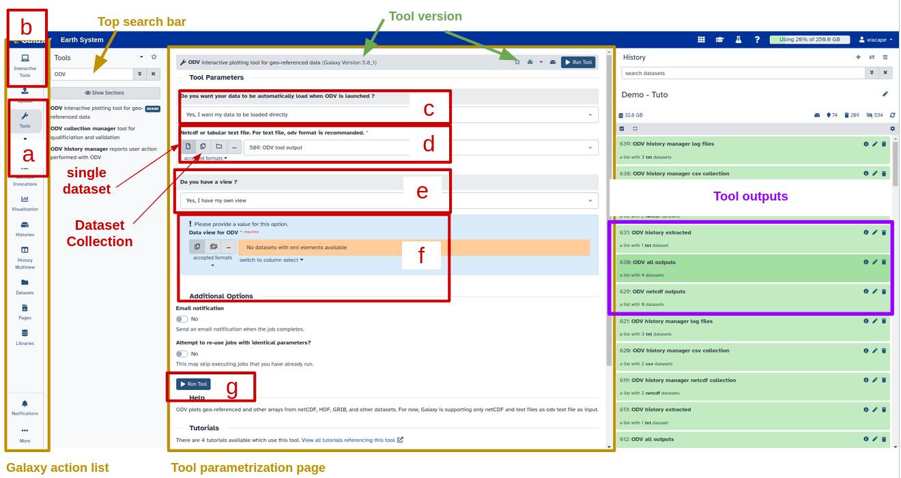
{: .hands_on}

> <details-title>How to open ODV</details-title>
> - When ODV is ready, a red dot appears on **Interactive Tools**  
> - Click it → open the ODV panel → click the expand symbol  
> - ODV opens in a new window with your selected view  
>
> 
> 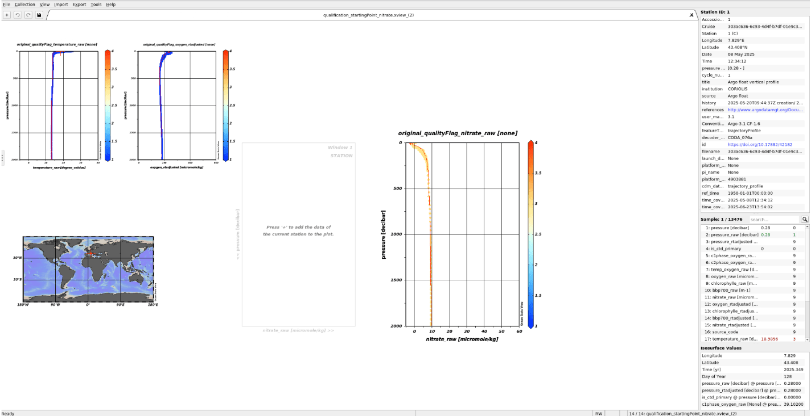
{: .details}

> <tip-title>ODV inactive</tip-title>
> After some inactivity, the ODV window may close. Just refresh the browser tab.
{: .tip}

> <tip-title>Copy/paste in ODV</tip-title>
> Open the clipboard (3 dots on the left panel) to copy-paste text.
> 
{: .tip}

### Step 3: Qualify the dataset with ODV

Use ODV features to apply QC flags and edits as needed. Refer to the [ODV guide](https://odv.awi.de/fileadmin/user_upload/odv/docs/ODV_guide.pdf).

### Step 4: Export history

> <hands-on-title>Export history</hands-on-title>
> - In ODV: **Export** > **History**
> - Save as default name `history_from_odv_collection.txt` in `working/Documents/ODV/galaxy/outputs`
> - Do not change the default filename
> - Close ODV (**File** > **Exit**)
>
> Outputs:  
> - Galaxy collection *ODV all outputs* (zip, history, odv_collection)  
> - File *ODV history extracted*  
{: .hands_on}

### Step 5: (optional) Report QC & Data changes

Run **ODV history manager** to report QC flags and/or data changes into the harmonized dataset before calibrating the nitrate sensor.

> <details-title>ODV history manager details</details-title>
>
> This tool extracts QC changes (EDITFLAGS) and data edits (EDITDATA) from the ODV history and reports them into the harmonized file(s).  
>
> It manages 2 types of ODV history files:  
> - *synthetic* (manual export)  
> - *extended* (automatic export, not yet available in Galaxy)  
>
> Default parameters:  
> - QC convention = ARGO QC flag scale  
> - ODV convention changes: EDITFLAGS, EDITDATA  
>
> Outputs:  
> - `###_harm_qced.nc` (extended NetCDF files including changes)  
> - `###_harm_history.csv` (summary of user changes)  
> - log file (`YYYY-MM-DDTHHMM_galaxy_odv-history-manager_history.log`)  
{: .details}

> <hands-on-title>Run ODV history manager</hands-on-title>
>
> - Click on **Tools** just below **Upload** on the left panel  
> - Search **ODV history manager** in the search bar  
> - Select the tool  
> - Its configuration page opens in the center panel
> 
> -  with the following parameters:
>
> Depending on your ODV spreadsheet file, select the appropriate inputs:
>
> **Case 1: using ODV collection manager output**
> - *Input NetCDF data*: harmonized file(s) `###_harm.nc` created by QCV harmonizer  
> - *Input history text file*: `ODV history extracted` (txt file exported from ODV after changes in Step 4)  
> - *Input ODV file*: `ODV collection manager output` (the ODV spreadsheet collection created by ODV collection manager)
>
> **Case 2: using odv_collection.txt**
> - *Input NetCDF data*: harmonized file(s) `###_harm.nc` created by QCV harmonizer  
> - *Input history text file*: `history_from_odv_collection.txt` (txt file inside *ODV all outputs*)  
> - *Input ODV file*: `odv_collection.txt` (spreadsheet collection created by ODV collection manager and opened in ODV for QC changes)
>
> (Optional) In **Tool Parameters**, you may change the default configuration:
> - *QC convention for the ODV output file*: select one of the [QC flag scales understood by ODV](https://odv.awi.de/fileadmin/user_upload/odv/docs/ODV_quality_flag_sets.pdf)  
> - *ODV convention regarding changes performed on the ODV collection*:  
>   - **EDITFLAGS** = report QC flag changes from history to the data collection  
>   - **EDITDATA** = report data edits from history to the data collection
>
> 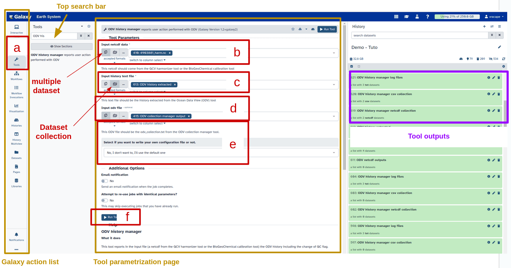
>
{: .hands_on}

> <tip-title>ODV edits parametrization</tip-title>
> You can unselect either *EDITFLAGS* or *EDITDATA* if you want to report only QC changes or only data changes.  
> However, you cannot unselect both. If you do, the backend will actually apply **both** edit types.
{: .tip}

> <warning-title>Check the logs</warning-title>
> At the end of the process, Galaxy distributes the tool outputs into 3 collections:  
> - **ODV history manager netcdf collection** (extended harmonized NetCDFs, `###_harm_qced.nc`)  
> - **ODV history manager csv collection** (CSV summaries, `###_harm_history.csv`)  
> - **ODV history manager log files** (with `YYYY-MM-DDTHHMM_galaxy_odv-history-manager_history.log`)  
>
> Always check the log file (click the  icon) to ensure that changes were correctly reported.  
> If issues persist, make sure filenames match Step 4 conventions.
{: .warning}

All these outputs will appear in your **History** (green status). They are now ready for the next step: **Biogeochemical Calibration**.

## Calibrate your data

### Nitrate

> <hands-on-title>(optional) Choose Reference dataset</hands-on-title>
> - Upload WOA nitrate climatology (NetCDF) from your computer  
> - Harmonize it with QCV harmonizer as in step 4  
{: .hands_on}

Currently, the tool **Biogeochemical calibration** is operational for **nitrate**.

> <hands-on-title>Run Biogeochemical calibration</hands-on-title>
> - Click on **Tools** → search **Biogeochemical calibration**  
> - Select the tool  
>
>  with the following parameters:
>   - *Input harmonized netcdf data*: `###_harm_qced.nc` (created by QCV harmonizer + ODV history manager)
>   - *Input reference data* (optional): WOA harmonized NetCDF file if you want to estimate reference nitrate from climatology
> - (Optional) Change default QC flag configuration (ARGO QC flag scale by default)
> - (Optional) Add calibration parametrizations:
>   - Single regression
>   - CanyonB (default)
>   - Climatology / WOA
>   - Custom P value with user-defined breakpoints
> - Run the tool
>
> 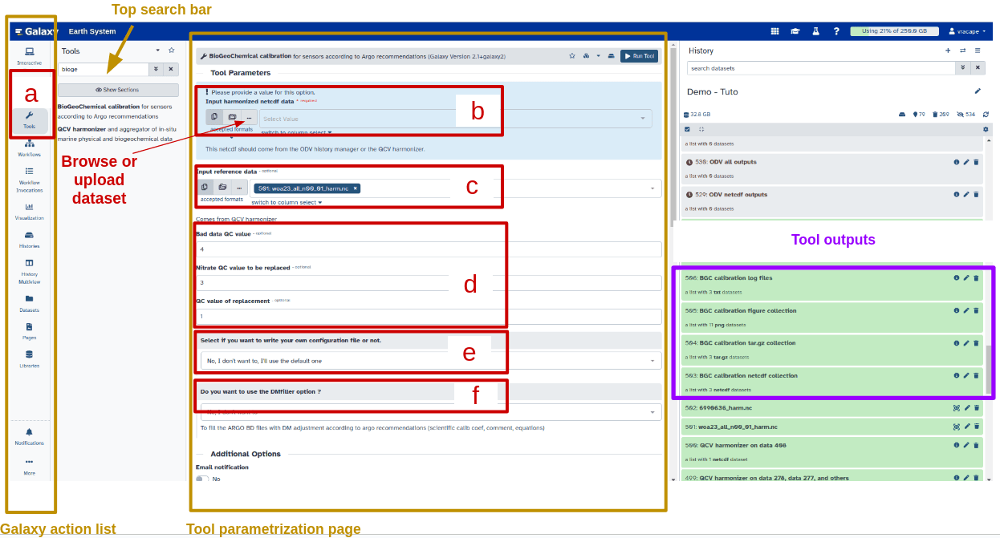
{: .hands_on}

> <details-title>Default calibration details</details-title>
> By default, the tool calibrates nitrate using:
> - Automatic evaluation of reference pressure
> - CanyonB as reference method
> - Linear regression for correction
> - ARGO QC flag convention
>
> Default QC flag mapping:
> - Bad Data QC = 4  
> - Raw QC value to replace = 3  
> - Replacement QC value = 1 (adjusted value)
>
> Possible configurations:
> - User-defined reference pressure
> - Canyon-med or WOA as reference method
> - Multi-linear regression with automatic or user-defined breakpoints
>
> Outputs per platform/configuration:
> - NetCDF file(s): `###_C{param}-nitrate.nc`
> - Diagnostic figures (up to 4):
>   - `###_..._LinearModel.png`
>   - `###_..._Rsquared.png`
>   - `###_..._Zvar_ref_detailed.png`
>   - `###_..._Zvar_ref_results.png`
> - Log file: `YYYY-MM-DDTHHMM_galaxy_odv-calibration-methods_nitrate_c.log`
{: .details}

> <details-title>Examples of parametrization</details-title>
> - Reproduce default method: set **Multiple linear regression** → *Single linear regression*  
> - Add canyon B automatic: leave default  
> - Add custom method:
>   - *Bypass*: user defines P → enter 1000 dbar  
>   - *Multiple linear regression*: N = number of breakpoints  
>   - *Reference method*: Climatology / WOA / Annual  
> (Ensure WOA harmonized climatology is included in inputs)
{: .details}

> <details-title>DMfiller option</details-title>
> If activated, the tool also updates original Argo NetCDF files with DM information and produces BD Argo files.
> - Requires:  
>   - Original raw NetCDF data (dataset collection 4903881)  
>   - CSV file from ODV history manager  
>   - Institution, BGC contact point, DM operator info  
> - If info is missing or inconsistent with original files, BD files are not delivered.  
>
> Outputs:
> - `###_C{param}-nitrate.tar.gz` (all BD files ready for DAC)
{: .details}

## Validate your data

Compare adjusted values with ODV:

> <hands-on-title>Validation with ODV</hands-on-title>
> - Re-run **ODV collection manager** including all calibrated NetCDFs from Step 5  
> - Launch **ODV interactive tool** again for visualization  
> - Inspect calibrated vs. raw/reference values  
{: .hands_on}

You may validate in two ways:

**Case 1: without external datasets**
- Create ODV collection with calibrated NetCDFs  
- Launch ODV without a view  
- ODV opens with new collection ready for validation  

**Case 2: with external datasets**
- Add an external dataset (ODV spreadsheet, ODV collection, or NetCDF supported by ODV)  
- Create ODV collection with calibrated + external data  
- Launch ODV without automatic load and without view  
- Import datasets manually via *File > New*  
- Map metadata and variables when prompted  
- Repeat for each external dataset  
- ODV is now ready for side-by-side comparison

> <tip-title>Advice</tip-title>
> Import first the ODV spreadsheet collection created by **ODV collection manager**.  
> Then import external datasets such as [webODV Glodap](https://explore.webodv.awi.de/ocean/hydrography/glodap/).
{: .tip}

# Extra information

Coming up soon even more tutorials on and other Earth-System related trainings. Keep an  open if you are interested!
