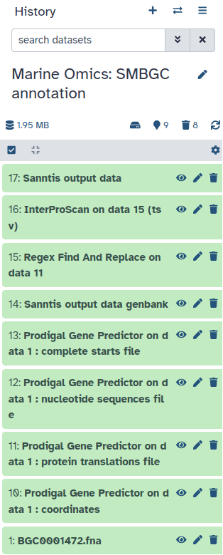
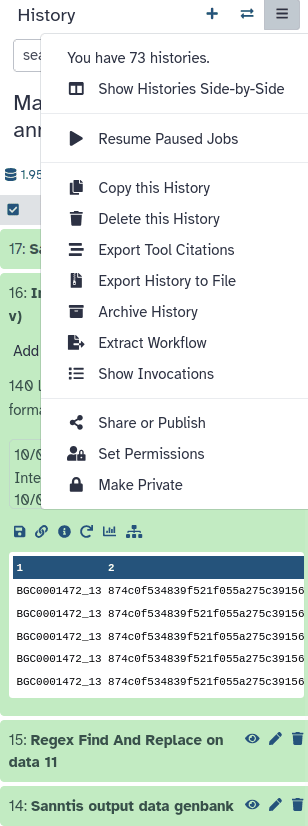
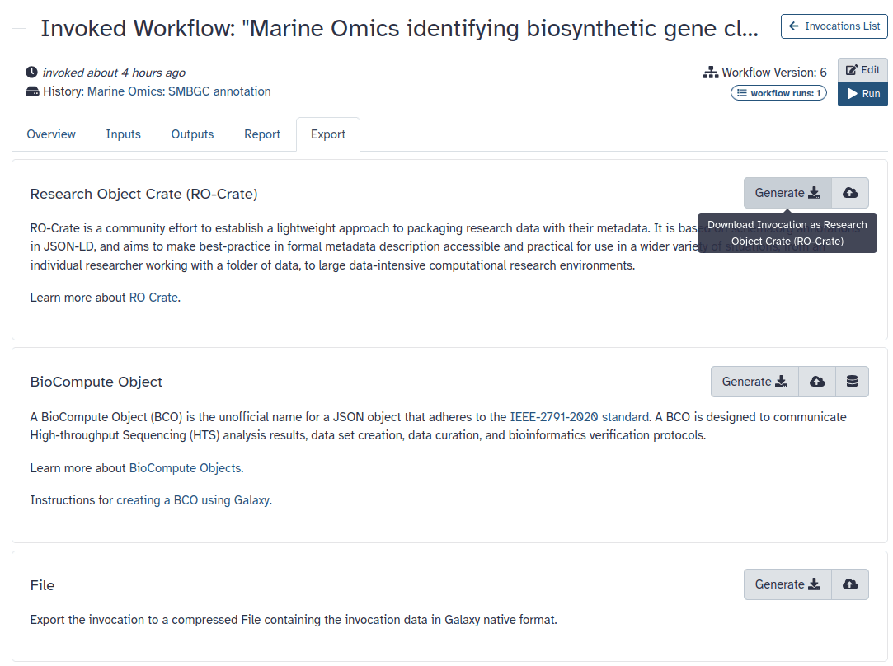
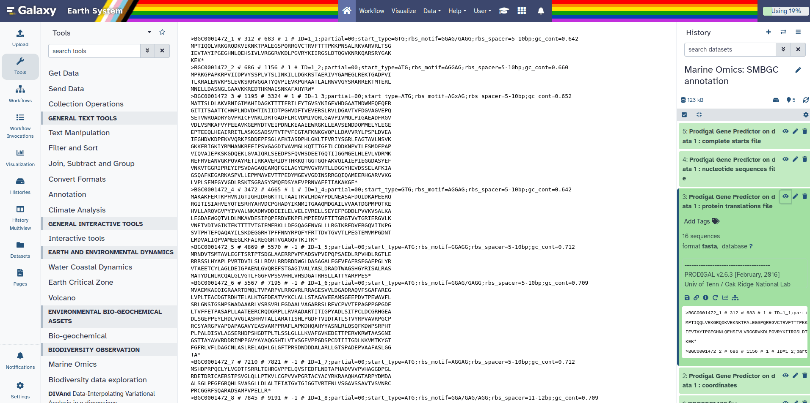
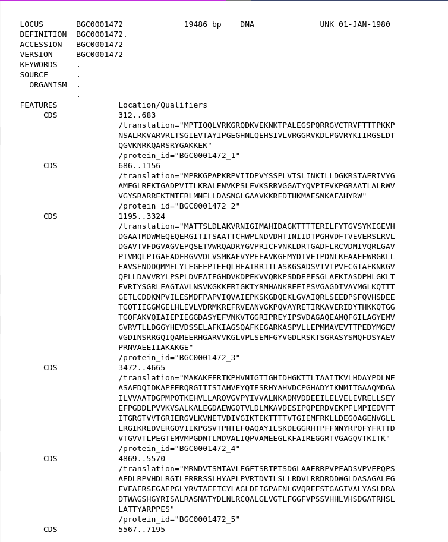
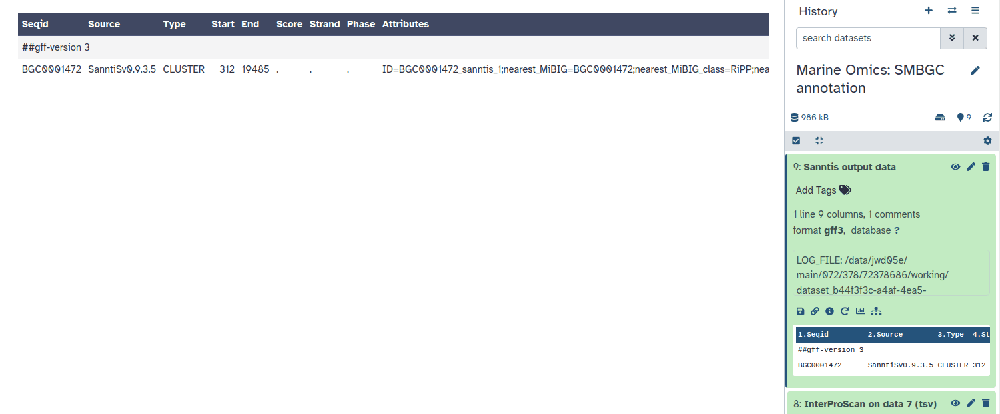

# Introduction
Through this tutorial, you will learn in the first part how to produce a protein fasta file from a nucleotide fasta file using Prodigal (it is a tool that predicts protein-coding genes from DNA sequences).

Then, you'll be using InterProscan to create a tabular. Interproscan is a batch tool to query the InterPro database. It helps identify and predict the functions of proteins by comparing them to known databases.

And finally, you will discover SanntiS both to build genbank and especially to detect and annotate biosynthetic gene clusters (BGCs).

> <agenda-title></agenda-title>
>
> In this tutorial, we will cover:
>
> 1. TOC
> {:toc}
>
{: .agenda}

# Get data
The FASTA file used in this example is, intentionally, a very small fraction of a genome (spanning exactly 1 BGC), and it's main purpose is to quickly check that all the pieces of the workflow are working.

> <hands-on-title> Data Upload </hands-on-title>
>
> 1. Create a new history for this tutorial and give it a name (for example “Marine Omics: SMBGC annotation”) for you to find it again later if needed.
>
>    
>
> 2. Import the file with this link `https://figshare.com/ndownloader/files/48574534`and name it BGC0001472.fna
>
>    
>
>
> 3. Rename the datasets BGC0001472.fna
>
>    
>
{: .hands_on}



# Import and launch the workflow
> <hands-on-title>Import the workflow</hands-on-title>
>   - Click on Workflow on the top menu bar of Galaxy. You will see a list of all your workflows.
>   - Option 1: use the URL
>   	- Click on  Import at the top-right of the screen
>   	- Paste the URL of the workflow into the box labelled “Archived Workflow URL” `https://earth-system.usegalaxy.eu/u/marie.josse/w/marine-omics-identifying-biosynthetic-gene-clusters`
>   - Option 2: use the workflow name
>   	- Click on **Public workflows** at the top-right of the screen
>       - Search for **Marine Omics identifying biosynthetic gene clusters**
>       - In the workflow preview box click on  Import
>   - Click the Import workflow button
{: .hands_on}

> <hands-on-title>Run the workflow</hands-on-title>
>    - Click on Workflow on the top menu bar of Galaxy. You will see a list of all your workflows.
>    - Click on the  (Run workflow) button next to your workflow
>    - /!\ Select **Yes** for **Workflow semi automatic**
>    - Configure the workflow as needed with the 2 datasets you uploaded right before (**BGC0001472.fna**)
>    - Click the Run Workflow button at the top-right of the screen
>    - You may have to refresh your history to see the queued jobs
{: .hands_on}

Now you don't have to do anything else. You should see all the different steps of the workflow appear in your history.
When the workflow is fully completed you should have the following history.

{: style="width:50%"}

> <tip-title>Extract a RO-Crate</tip-title>
> Workflows are a powerful Galaxy feature that allows you to scale up your analysis by performing an end-to-end analysis with a single click of a button. In order to keep provenance of the workflow invocation (an invocation of a workflow means one run or execution of the workflow) it can be exported from Galaxy in the form of a Workflow Run Crate RO-Crate profile.
>
>
> After the workflow has completed, we can export the RO-Crate. The crate does not appear in your history, but can be accessed from the User -> Workflow Invocations menu on the top bar.
>
> > <hands-on-title> Extract a RO-Crate </hands-on-title>
> >
> > 1. In the top right of your history, go to  -> Show Invocations
> >
> > 
> >
> > Our latest workflow run should be listed at the top.
> >
> > 2. Click on it to expand it:
> >
> > 
> >
> > 3. Click on the Export tab in the expanded view of the workflow invocation.
> > 	You should see a page that contains three download options:
> >		- Research Object Crate (RO-Crate)
> >		- BioCompute Object
> >		- File
> > 4. Click on the **Generate**  option of the RO-Crate box (1st box)
> >
> > 
> {: .hands-on}
>
>
> Great work! You have created a Workflow Run Crate. This makes it easy to track the provenance of the executed workflow.
{: .tip}

# Prodigal Gene Predictor: generate a protein fasta file

## Prodigal Gene Predictor

Prodigal is a tool that predicts protein-coding genes from DNA sequences. It takes a nucleotide FASTA file as input and identifies regions that are likely to code for proteins. The output is a protein FASTA file where each sequence represents a predicted protein. Some of these sequences end with an asterisk (*), which marks the end of a complete protein sequence identified by Prodigal. This asterisk is added when Prodigal detects a full protein-coding region that ends with a stop codon. Sequences without an asterisk either represent partial proteins or do not end in a typical stop codon.

> <hands-on-title> Run prodigal </hands-on-title>
>
> 1.  with the following parameters:
>    -  *"Specify input file"*: `BGC0001472.fna` (Input the nucleotide fasta file)
>    - *"Specify mode"*: `Meta : Anonymous sequences, analyze using preset training files, ideal for metagenomic data or single short sequences`
>
>    You don't need to change any other parameters leave them on the default input.
>
> 2. Click on **Run Tool**
>
{: .hands_on}

You should have 4 new outputs appearing in your history. In these outputs you should have **Prodigal Gene Predictor on data 1 : protein translations file**.
You can click on it and then click on the  (eye).

You can notice here that at each end of the sequence there's a *. Later on we will need to remove this star. But, first we are going to use this protein file to build the Genbank that SanntiS need to make a SMBGC annotation.

## SanntiS for building a Genbank file

This step combines the original nucleotide sequences with the cleaned protein sequences to create a GenBank format file. This format is widely used for storing and organising information about DNA sequences and their annotations. In this step, the DNA sequences and their corresponding coding regions are transformed into a format that is suitable for SanntiS.

> <hands-on-title> Build Genbank </hands-on-title>
>
> 1.  with the following parameters:
>    - *"Do you want to build a genbank or to make a SMBGC Annotation?"*: `Build genbank`
>        -  *"Input a nucleotide fasta file"*: `BGC0001472.fna` (Input the nucleotide fasta file)
>        -  *"Input a protein fasta file"*: `Prodigal Gene Predictor on data 1 : protein translations file` (output of **Prodigal Gene Predictor** )
> 2. Click on **Run Tool**
>
{: .hands_on}

## Regex Find And Replace
Remember earlier we noticed the star * in the protein fasta file ?

Now is the time to remove it !

The asterisks at the end of some protein sequences are informative but can cause issues with some analysis tools. In this step, we remove these asterisks to produce a clean protein FASTA file, making it ready for further analysis.

> <hands-on-title> Remove * </hands-on-title>
>
> 1.  with the following parameters:
>    -  *"Select lines from"*: `Prodigal Gene Predictor on data 1 : protein translations file` (output of **Prodigal Gene Predictor** )
>    - In *"Check"*:
>        -  *"Insert Check"*
>            - *"Find Regex"*: `\*$`
>            - *"Replacement"*: `` (leave an empty box there)
>
> 2. Click on **Run Tool**
>
{: .hands_on}

Check if the * were well removed.

# InterProScan

InterProScan is a tool that helps identify and predict the functions of proteins by comparing them to known databases. This tool analyses the protein sequences and produces an output file containing detailed information about the possible functions, domains, and families associated with these proteins.

> <hands-on-title> Task description </hands-on-title>
>
> 1.  with the following parameters:
>    -  *"Protein FASTA File"*: `Regex Find And Replace on data **` (output of **Regex Find And Replace** )
>    - *"Use applications with restricted license, only for non-commercial use?"*: `No`
> You can leave all the other parameters on the default input.
>
> 2. Click on **Run Tool**
{: .hands_on}

{: style="width:50%"}

# SanntiS for annotating biosynthetic gene clusters

SanntiS is a tool specifically designed to detect and annotate biosynthetic gene clusters (BGCs). It uses neural networks trained on InterPro signatures to achieve high accuracy in identifying BGCs in both genomic and metagenomic datasets 1. A significant benefit of using SanntiS is that your results will be comparable with a large number of datasets, including over 5,000 marine metagenomic assemblies archived in the [MGnify](https://www.ebi.ac.uk/metagenomics) resource. This tool provides valuable insights into the biosynthetic potential of organisms or environmental samples. The final output is a GFF file containing detailed BGC annotations, which can be used for further analyses or applications.

> <hands-on-title> Identify biosynthetic gene clusters </hands-on-title>
>
> 1.  with the following parameters:
>    - *"Do you want to build a genbank or to make a SMBGC Annotation?"*: `Run SanntiS`
>        -  *"Input the tabular file from InterProScan"*: `InterProScan on data **` (output of **InterProScan** )
>        -  *"Input a Genbank file"*: `SanntiS output data genbank` (output of **SanntiS biosynthetic gene clusters** )
>
> 2. Click on **Run Tool**
{: .hands_on}

Finally, you should have one gff3 file in your history under **SanntiS output data**

# Conclusion
Here you now know how to conduct a Marine Omics analysis

# Extra information

Coming up soon even more tutorials on and other Earth-System related trainings. Keep an  open if you are interested!
