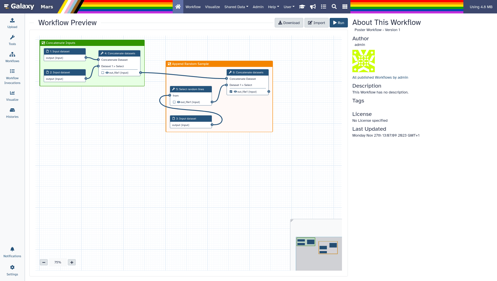
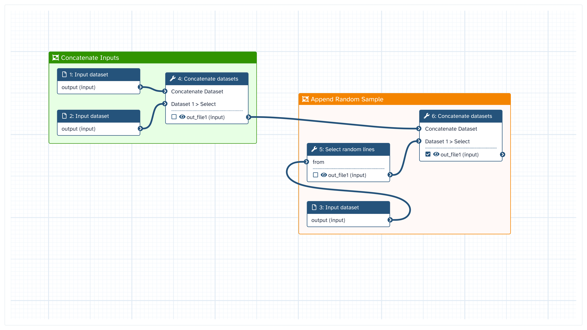

Sometimes we want to share our workflows outside of Galaxy, like printing it on a poster.
Making screenshots of Workflows looses a lot of detail, often to an degree where information is lost.

There are third party tools which can help us in making high resolution screenshots that preserve all details
and produce pictures which are suitable for printing and sharing.



> <agenda-title></agenda-title>
>
> In this tutorial we will cover:
>
> 1. TOC
> {:toc}
>
{: .agenda}

# Making a high-resolution Screenshot of a Galaxy Workflow

<div class="Print" markdown="1">
In this section we will learn on how to make an image of a workflow which is suitable for printing on a poster.
</div>

<div class="Web" markdown="1">
In this section we will learn on how to make a screenshot of a workflow which preserves as much details as possible.
</div>

We will be using a feature built into the [Firefox](https://www.mozilla.org/firefox/) web browser to make screenshots larger than our screen.
This only works in Firefox, so make sure you have it installed and are using it to follow the rest of this tutorial.

## Hiding the Galaxy UI

<div class="Print" markdown="1">
For our Workflow poster, we will likely not want to print the rest of Galaxys user interface.
</div>

<div class="Web" markdown="1">
For our screenshot, we may want to hide the rest of Galaxys user interface, so the focus is on the Workflow itself.
</div>

We could cut it out of the final image using image-manipulation tools, but this is slow and cumbersome, especially for high-res images.

From Galaxy version 23.2 onwards there is a feature with which we can hide the Galaxy UI directly.
It is meant to be used for embedding workflows, but can be accessed directly, which is perfect for purpose.

> <hands-on-title>Hiding the Galaxy UI for a Workflow</hands-on-title>
>
> 1. **Opening the Workflow Preview**
>    - Navigate to your Workflows list
>    - Press " View" on your desired Workflow
>    - You should now see the preview page, which should look similar to this:
>      
> 2. **Add the following to the URL in your browser:**
>
>    ```
>    &embed=true&buttons=false&about=false&heading=false&minimap=false&zoom_controls=false
>    ```
> 
> 3. **You should now see your Workflow rendered as shown below:**
>
>    
>    In this view, you can still zoom in and out using your mouse-wheel, and drag the canvas around.
>
{: .hands_on}

> <details-title>What does the text in the URL do?</details-title>
>
> These are so called query-parameters. They are chained to the existing parameters with a `&` symbol. 
> Each parameter tells galaxy to render the UI slightly differently.
> If you're curios at what they all do, try removing them individually and reloading the page.
>
{: .details}

> <comment-title></comment-title>
> If you cannot see a preview page like in the first screenshot, or if the query parameters have no effect,
> you are on a Galaxy version older than 23.2
>
> You can still follow the rest of this tutorial to learn how to make high-resolution screenshots.
{: .comment}


## Exporting high-res screenshots

Now that we have a view of our Workflow without the Galaxy UI, let's make a high-res screenshot using Firefox.

<div class="Print" markdown="1">
Firstly position your Workflow, so all of it is visible in the way you would like it to be on the poster.
</div>

<div class="Web" markdown="1">
Firstly position your Workflow, so all of it is visible in the way you would like it to be on the screenshot.
</div>

> <tip-title>Can't fit your entire Workflow at once?</tip-title>
> 
> If you zoomed out as far as possible, but can't view all of your Workflow, try the following:
> * Navigate back to the full Workflow preview page (without the UI hidden)
> * Click anywhere outside of the Workflow preview (e.g. on the about section)
> * Zoom out the entire browser window a bit, by using <kbd>Ctrl</kbd> + <kbd>Mouse Wheel</kbd>, or <kbd>Ctrl</kbd> + <kbd>-</kbd>
> * Re-add the query parameters we added in the previous section
> * If you still can't fit all of it, repeat the above steps
{: .tip}

> <hands-on-title>Creating a high-resolution screenshot</hands-on-title>
> 
> 1. **Open the Firefox Javascript console.** To do this, either:
>    - Use the shortcut <kbd>Ctrl</kbd> + <kbd>Shift</kbd> + <kbd>K</kbd> (On OS X <kbd>Cmd</kbd> + <kbd>Shift</kbd> + <kbd>K</kbd>)
>    - Or navigate to the console using your mouse:
>       * Menu
>       * More Tools
>       * Web Developer Tools
>       * Console Tab
>
> 2. **Resize or move the console**
>
>    The console may be in the way of your Workflow.
>
>    You can make it take up less space by dragging down the bar at the top.
>
>    You can also reposition it to the side, by selecting the three dots in the upper right corner of the console,
>    and choosing a different position from: "Dock to Bottom", "Dock to Right", "Dock to Left", "Separate Window".
>
> 3. **Make the screenshot**
>
>    In the Javascript console type:
>    ```
>    :screenshot --dpr 6
>    ```
>    After a short moment, a new screenshot should appear in your downloads folder.
>
>    The value "6" after the `--dpr` option is just an example. Keep reading to learn how to choose the right dpr value.
>
{: .hands_on}

<div class="Print" markdown="1">
> <tip-title>Choosing the right dpr value for print</tip-title>
>
> `dpr` stands for **D**evice **P**ixel **R**atio.
>  
> This is how much Firefox will scale up your screenshot. A dpr of 2, will make your screenshot twice as wide and high as you browser window.
> 
> Always go higher than you think you need, when choosing a dpr for print.
> Here's a rule-of thumb on how to determine the correct dpr:
>
> * Think about how much bigger your poster is going to be than your browser window, in physical dimensions.
>   If unsure, round up.
> * Multiply that number by 2
>
> Example: If your poster will be roughly 4 times larger than your browser window, choose a dpr of 8.
>
{: .tip}
</div>

<div class="Web" markdown="1">
> <tip-title>Choosing the right dpr value for your screenshot</tip-title>
>
> `dpr` stands for **D**evice **P**ixel **R**atio.
>  
> This is how much Firefox will scale up your screenshot. A dpr of 2, will make your screenshot twice as wide and high as you browser window.
>
> Choosing the right dpr for a screenshot depends on how much you've zoomed out.
> If you've zoomed out to about half the starting size, go with a dpr of two.
> If you want your screenshot to be extra crisp, add 2.
>
> Example: You zoomed out to 25%. Use a dpr of 4 (`25% * 4 = 100%`), then add 2 for extra detail equals a dpr of 6.
>
> To check if you've chosen an appropriate dpr, open the screenshot in firefox,
> click it to zoom in to 100%, and check if all text is clearly readable.
>
{: .tip}
</div>

# Compressing Workflow Screenshots

<div class="Print" markdown="1">
You may have noticed the file-size of your screenshot it very large.
Some print services may have restrictions on file size, and you won't be able to upload your screenshot for printing.
</div>

<div class="Web" markdown="1">
You may have noticed the file-size of your screenshot it very large.
You will likely not be able to upload it anywhere, as it is larger than most services allow images to be.
</div>

In the following section, you will learn how to compress your screenshot to a smaller file-size.

## Palette Compression

There are many ways to compress an image.
Palette compression is particularly well suited for workflows.
It can heavily reduce file size with minimal loss, if the amount of colors in an image is fairly low.

To compress our image, we will be using a piece of software called [GraphicsMagick](http://www.graphicsmagick.org/)

This tool is known to be installed on [usegalaxy.eu](https://usegalaxy.eu), we suggest you follow these steps there:

> <hands-on-title>Uploading Your Image</hands-on-title>
>
> 1. Open [usegalaxy.eu](https://usegalaxy.eu)
> 1. At the top of the  **Tools** panel (on the left), click  **Upload Data**
> 1. Select "Choose Local Files" from the bottom of the dialog
> 1. Select your saved screenshot, likely from your Downloads folder.
> 1. Click **Start**
> 1. Click **Close**
>
{: .hands_on }

With the data on your Galaxy, we can start trying to compress it!

> <hands-on-title>Compressing your screenshot</hands-on-title>
> 1. Run the  tool
>    -  *"Image to convert"*: `screenshot.png`
>    -  *"Reduce Color Palette"*: `Automatic`
>    -  *"Output Format"*: `png`
>
>    This will have GraphicsMagick use automatic palette compression.
>    This command may take a while.
>
> 1. **Open the compressed image** to check if everything is still clearly visible.
>    
>    Also check if the file size is now small enough for your purposes. (Click the dataset in your history to expand it to see the file size.)
>
> 1. If you want more control over your output file, you can provide a number of colours, instead of using the automatic reduction. Let's re-run the tool and provide a number of colours you want to keep in your output image. This number should be in powers of two (4, 8, 16, 32, 64 etc.).
>
>    Using smaller numbers will further reduce the file size at the cost of image quality.
>    Smaller values do not always yield smaller files! Experiment a bit, or go with the option from step 4 for simplicity.
>
> 1. Run the  tool
>    -  *"Image to convert"*: `screenshot.png`
>    -  *"Reduce Color Palette"*: `Manual`
>    -  *"Color Palette Size"*: `4`
>    -  *"Output Format"*: `png`
>
> 1. Try different values until you get a result you like! Did you manage to create a smaller result than the automatic palette compression?
{: .hands_on }

> <tip-title>Tips for compressing images</tip-title>
> 1. JPEG is a naturally "lossy" format, you can try that instead of PNG
> 1. If the image is quite large, consider scaling it down with the "Resize %" parameter
> 1. Experiment with the colour palettes! You will likely be able to find one that is a good tradeoff between accuracy and file size for your use case.
{: .tip}


Here's an example workflow screenshot compressed from `2.4mb` to `830kb`. Click it to view it in full resolution.


