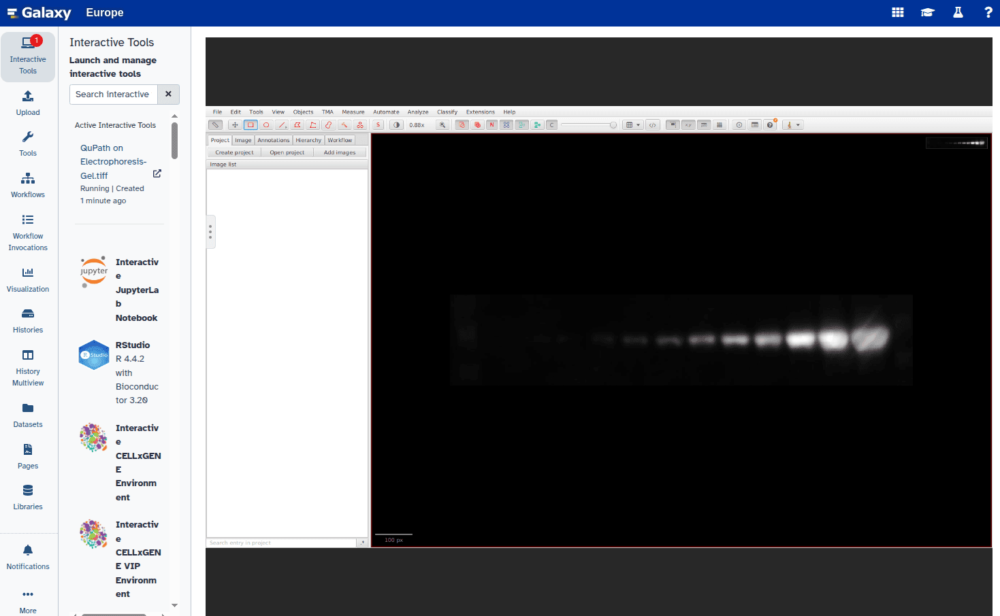
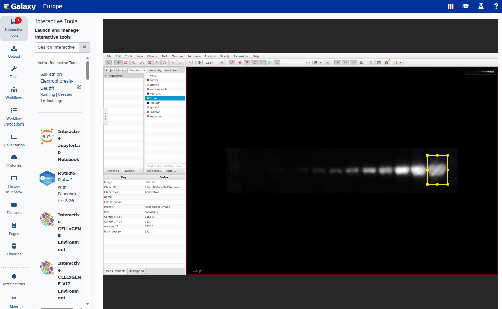
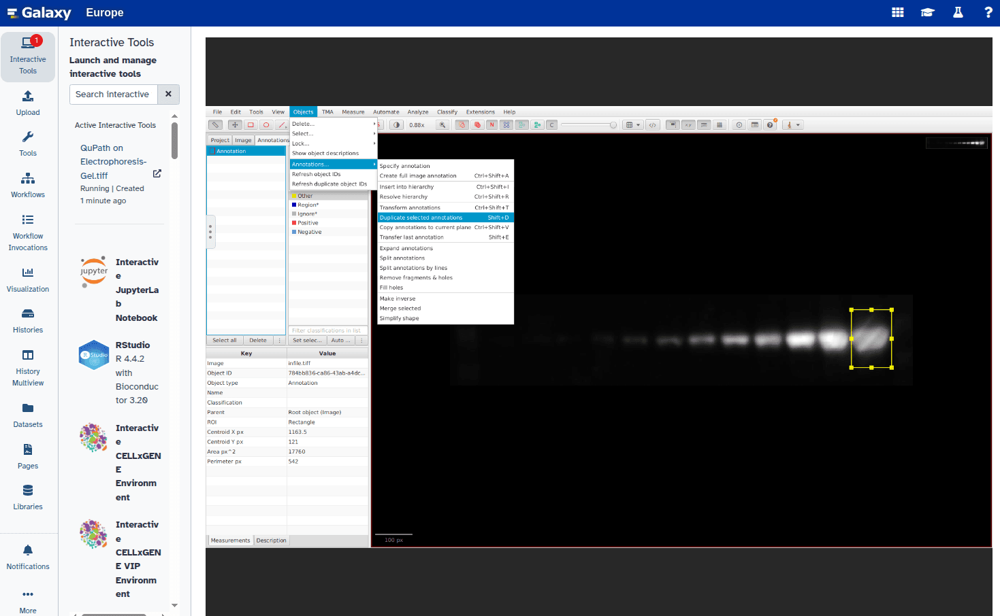
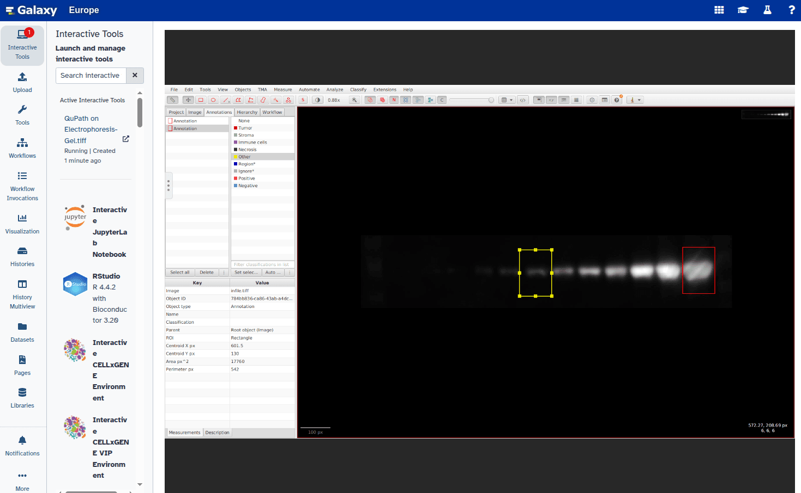
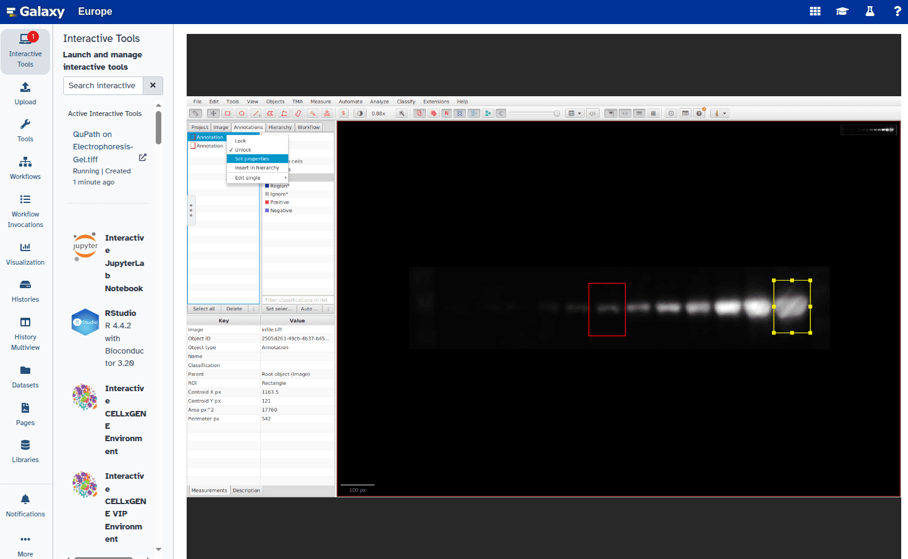
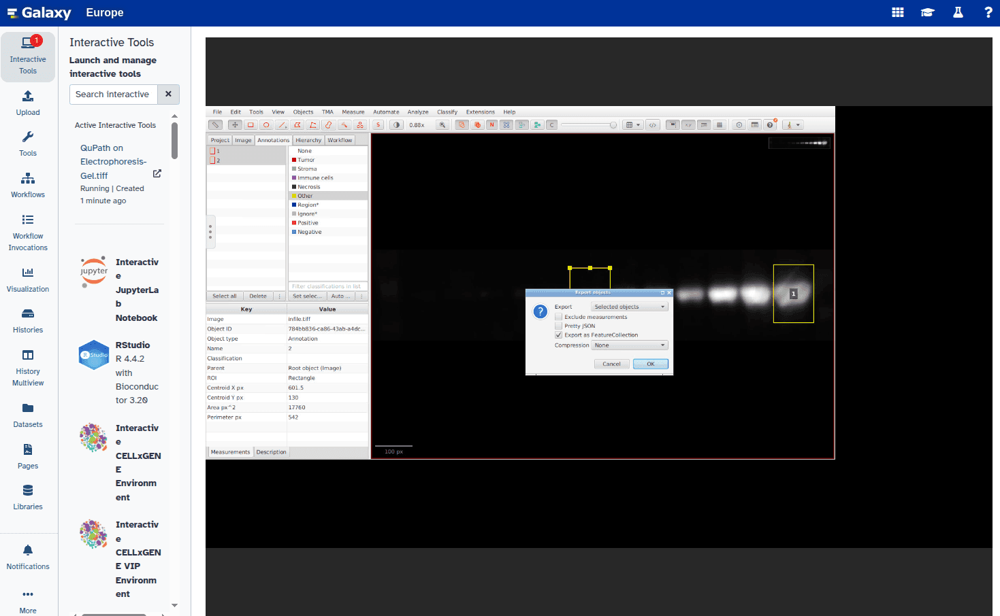
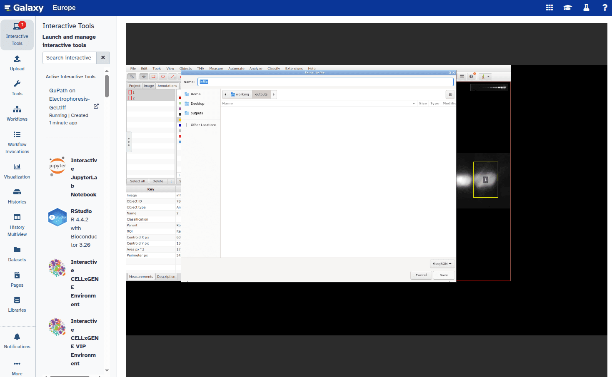

Electrophoresis gel images are fundamental tools in molecular biology and biochemistry for separating DNA, RNA, or protein fragments by size or charge (). Quantification of these bands allow for estimating product yield, comparing amplification efficiency, verifying PCR products, calculating molecular weights, and assessing enzyme activity or protein purity ().

Reliable measurement of band intensity provides quantitative insights into gene expression and other biochemical properties (). However, manual quantification can be labor-intensive and prone to user bias.

Modern image analysis software suites such as **QuPath** () provide interactive tools for defining **regions of interest (ROIs)** directly on gel images. These ROIs can be exported as **GeoJSON** files, which encode the spatial coordinates of the selected bands in a standardized, machine-readable format.

Once the ROI file is generated, bioinformatics platforms like **Galaxy** () enable automated processing of these coordinates, measurement of pixel intensities for each band, and generation of transparent, reproducible quantification results.

Recent advances such as **GelGenie** () further highlight the trend towards AI-powered, automated analysis pipelines for electrophoresis gels, reinforcing the need for accessible, reproducible workflows that integrate modern image processing tools.

> <agenda-title></agenda-title>
>
> In this tutorial, we will deal with:
>
> 1. TOC
> {:toc}
>
{: .agenda}

# Data preparation

The example dataset can be downloaded from here [Electrophoresis gel dataset](https://github.com/galaxyproject/training-material/tree/main/topics/imaging/images/electrophoresis-gel-bands-image-analysis/Image.jpg).

This image was published by [Kenji Ohgane et al. (2019) on Protocols.io](https://www.protocols.io/view/quantification-of-gel-bands-by-an-image-j-macro-ba-bp2l6n4bkgqe/v1).

> <hands-on-title>Download and upload the image</hands-on-title>
>
> 1. Create a new history in Galaxy.  
> 2. Download the test image using the link above.  
> 3. Click the ** Upload** to add the image file into your galaxy history.  
>
>    
>
>    
>
>    
>
> 4. Rename  the dataset to `Electrophoresis-Gel.jpg`.
>
{: .hands_on}

Before we dive into the quantification steps let's convert our JPG image file into the TIFF image format. This format is preferred for analysis and quantification as it preserves the image data and metadata. 

**Note:** Skip this step if the image is already in TIFF format.

## Convert the image format

> <hands-on-title>Convert JPG to TIFF</hands-on-title>
>
> 1.   
>    - *"Image to convert"*: `Electrophoresis-Gel.jpg`  
>    - *"Output format"*: `TIFF`
>
>   > <tip-title> Why TIFF? </tip-title>
>   >
>   > TIFF files preserve full image quality, avoid compression artifacts, and are compatible with downstream tools that require uncompressed data.
>   >
>   {: .tip}
>
{: .hands_on}

## Obtain image metadata

To convert coordinates into a label map, we first need the image dimensions (width and height). In this step, we'll retrieve that information.

> <hands-on-title>Identify image dimensions</hands-on-title>
>
> 1.   
>    -  *"Image Input"*: Select your uploaded `Electrophoresis-Gel.tiff`
>
{: .hands_on}

The output of the tool can be visualize by clicking the  (eye) icon (**View**). See below:

  <pre style="display: inline-block; text-align: left; background: #f4f4f4; padding: 1em; border-radius: 8px; font-size: 14px; line-height: 1.4;">
Checking file format [Tagged Image File Format]
Initializing reader
TiffDelegateReader initializing /data/dnb11/galaxy_db/files/0/6/6/dataset_06685fae-ac3e-48b9-a460-d0ad39ea07a6.dat
Reading IFDs
Populating metadata
Checking comment style
Populating OME metadata
Initialization took 0.569s

Reading core metadata
filename = /data/dnb11/galaxy_db/files/0/6/6/dataset_06685fae-ac3e-48b9-a460-d0ad39ea07a6.dat
Series count = 1
Series #0 :
	Image count = 1
	RGB = true (3) 
	Interleaved = false
	Indexed = false (false color)
	Width = 1278
	Height = 250
	SizeZ = 1
	SizeT = 1
	SizeC = 3 (effectively 1)
	Thumbnail size = 128 x 25
	Endianness = intel (little)
	Dimension order = XYCZT (certain)
	Pixel type = uint8
	Valid bits per pixel = 8
	Metadata complete = true
	Thumbnail series = false
	-----
	Plane #0 <=> Z 0, C 0, T 0

Reading global metadata
BitsPerSample: 8
Compression: JPEG
Document Name: temp.tiff
ImageLength: 250
ImageWidth: 1278
MetaDataPhotometricInterpretation: RGB
MetaMorph: no
NumberOfChannels: 3
PageNumber: 0 1
PhotometricInterpretation: YCbCr
PlanarConfiguration: Chunky
ReferenceBlackWhite: 0
SampleFormat: unsigned integer
SamplesPerPixel: 3
Software: GraphicsMagick 1.3.45 2024-08-27 Q8 http://www.GraphicsMagick.org/

Reading metadata
  </pre>

## Split image into separate channels

TIFF images can store multiple channels—such as different colors or fluorescence signals—in a single file. In this step, we will separate these channels by splitting the image along the channel axis (C-axis). This results in a list of single-channel images, which are required for the next processing steps.

> <hands-on-title>Split image into single channels</hands-on-title>
> 1.  with the following parameters:
>    -  *"Image to split"*: Select your uploaded `Electrophoresis-Gel.tiff` file
>    - *"Axis to split along"*: Select `C-axis (split the channels of an image or image sequence)` from the dropdown menu
>
{: .hands_on}

> <comment-title>Use a single-channel image for downstream compatibility and annotation</comment-title>
> While QuPath can handle multi-channel images, our other tools cannot. Therefore, after splitting the image, we will use the  tool to select one of the single-channel images. This image should represent the intensity channel we want to measure, and will be used for QuPath regions of interest (ROI) annotation.
>
{: .comment}

> <hands-on-title>Extract the TIFF file from collection</hands-on-title>
>
> 1.  with the following parameters:
>    -  *"Input Collection"*: Select the collection output from the  tool
>    - *"Which part of the Collection?"*: Choose the TIFF file that represent the channel of your interest. In our dataset example, we extract 1.tiff
>
{: .hands_on}
{: .hands_on }

# Annotate and process regions of interest (ROIs)

To identify and quantify specific regions in the image, such as electrophoresis bands, we need to define them manually. This is done using the interactive tool **QuPath**, which allows you to draw rectangles over each band of interest and assign them a unique label to annotate the ROIs. The result is a **GeoJSON** file containing the coordinates of these regions.

This GeoJSON file can then be processed in Galaxy to generate a label map for image quantification.

## Prepare the ROI file with QuPath

In this step, you will open the image in QuPath, annotate the ROIs using rectangles, and export the annotations as a GeoJSON file. Each band should be marked with a rectangle and given a unique name (e.g., "1", "2", etc.). 

> <hands-on-title>Select ROIs and export GeoJSON file</hands-on-title>
> 
> 1. Open the image in **QuPath** using our interactive tool  with the following parameters:
>    -  *"Input file in TIFF format"*: Select the `Electrophoresis-Gel.tiff` dataset after channel splitting.
>    
>    When the image opens in QuPath, set the image type to `Other`:  
>    
>
> 2. Select the **Rectangle tool** from the toolbar:  
>    
>
> 3. Draw a rectangle around the first band of interest:  
>    
>
> 4. Open the **Annotations** panel:  
>    
>
> 5. Double-click the rectangle and set its type to `Other`:  
>    
>
> 6. Duplicate the annotation to create additional rectangles:  
>    - Go to **Object → Annotations**  
>    - Select **Duplicate selected annotations**  
>    
>
> 7. Verify the new rectangle appears in the Annotations panel:  
>    
>
> 8. Select the new rectangle and reposition it over the next band:  
>      
>    
>
> 9. Repeat steps 6–8 for all bands you want to annotate.
>
> 10. Set a unique label for each annotation:  
>     - Right-click each rectangle, choose **Set parameters**, and enter a label (e.g., `"1"`, `"2"`)  
>       
>     
>
> 11. Confirm that all rectangles are labeled:  
>     
>
> 12. Select all labeled annotations:  
>     
>
> 13. Export the annotations as a GeoJSON file:  
>     - Click **File → Export objects as GeoJSON**  
>     - Choose **Export as FeatureCollection**  
>     - Click **Save**  
>       
>       
>     
>
> 14. Exit QuPath:  
>     - Click **File → Quit**  
>     - Save changes if prompted  
>       
>     
>
> 15. The exported file will appear in your Galaxy history as part of a collection within 2–3 minutes.
>
{: .hands_on}

## Extract the GeoJSON file

QuPath exports the annotations as a Galaxy collection. In this step, we extract the GeoJSON file to use it in the next stage of the analysis.

> <hands-on-title>Extract the GeoJSON file</hands-on-title>
>
> 1.  with the following parameters:
>    -  *"Input Collection"*: Select the `QuPath outputs` collection
>    - *"Which part of the Collection?"*: Choose the GeoJSON file
>
> 2.  **Rename** the extracted file to `Bands.geojson`.
>
{: .hands_on}

## Convert ROIs to label map

Now that we have the coordinate information in GeoJSON format, we can convert it into a label map. This label map is an image where each ROI is assigned a unique label, allowing it to be quantified or visualized in downstream steps. In this step, you will also need the information obtained earlier with the  tool about the width and height of the image. 

> <hands-on-title>Convert coordinates to label map</hands-on-title>
>
> 1.  with the following parameters:
>    -  *"List of points in tabular or GeoJSON format"*: Select your `Bands.geojson` file
>    - *"Width of output image"*: `1278` (Use the width from the **Show image info** result)
>    - *"Height of output image"*: `250` (Use the height from the **Show image info** result)
>    - *"Tabular list of points has header?"*: `Yes`
>
{: .hands_on}

# Extract band intensity features

> <hands-on-title>Measure band intensity</hands-on-title>
>
> 1.   
>    - *"Label map"*: Output from previous step  
>    - *"Use the intensity image"*: `Use intensity image`  
>    - *"Intensity image"*: `Electrophoresis-Gel.tiff`  
>    - *"Features to compute"*:
>      - Select: "Label from label map"
>      - Select: "Mean Intensity"
>
{: .hands_on}

## Inspecting results

The table result can be inspected by clicking on the  (eye) icon (**View**) of the tool output and used for further analysis.

# Conclusion

In this tutorial, we explored a complete workflow for quantifying electrophoresis gel bands by:

- Uploading and converting the gel image into a suitable format  
- Interactively selecting bands as regions of interest (ROIs) using QuPath  
- Exporting ROI coordinates and converting them into a label map in Galaxy  
- Measuring the intensity of each band and extracting the results in tabular format

By combining **QuPath** for annotation and **Galaxy** for analysis, this approach offers a transparent, reproducible, and user-friendly method for gel band quantification, suitable for a variety of molecular biology applications.
