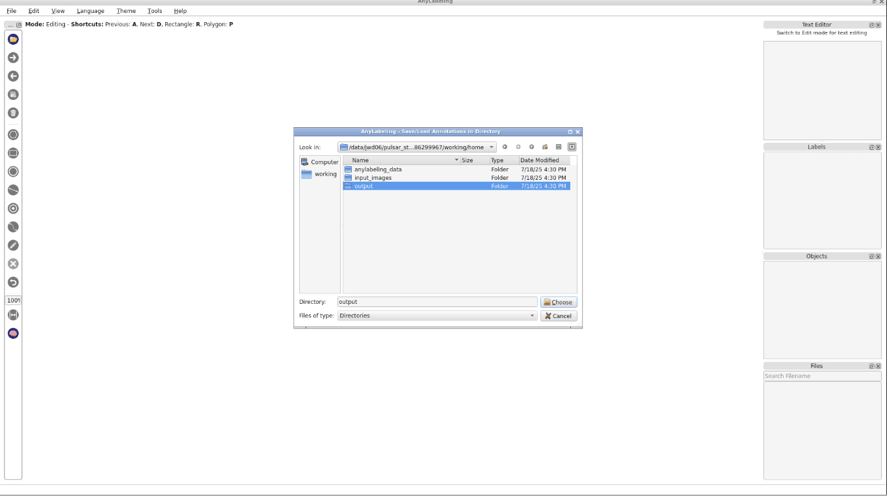
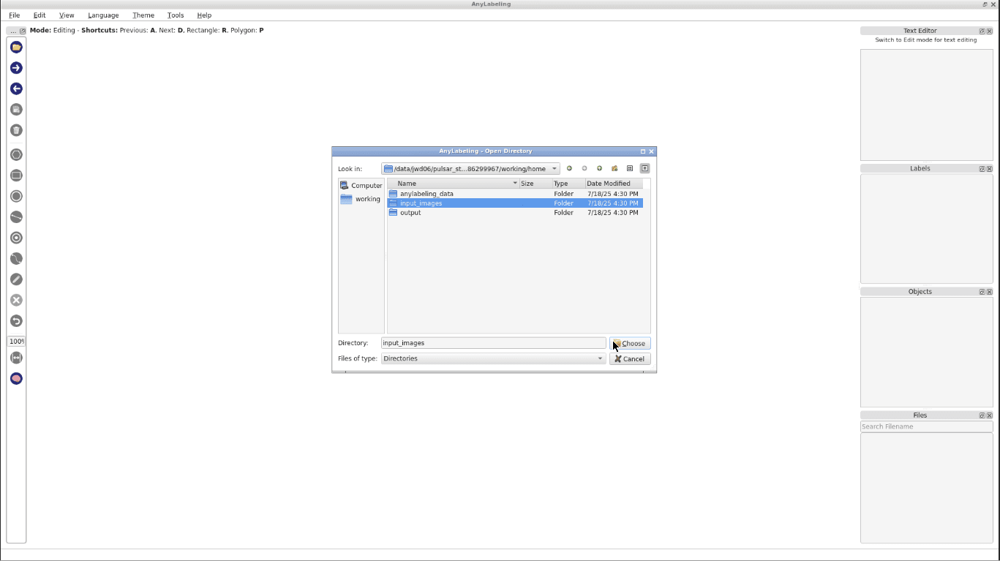
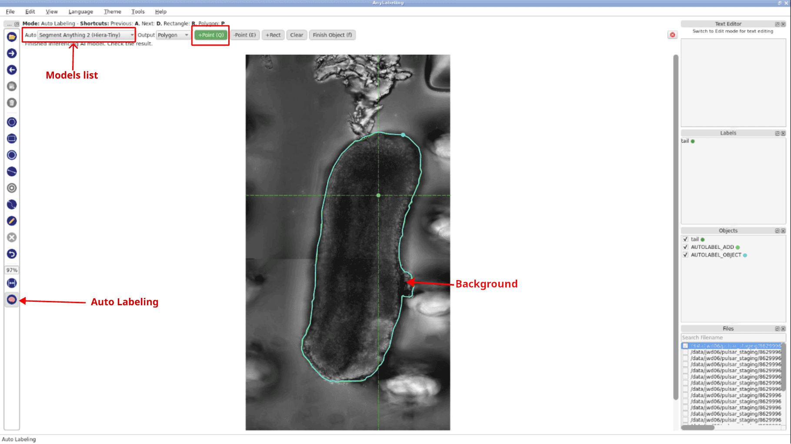
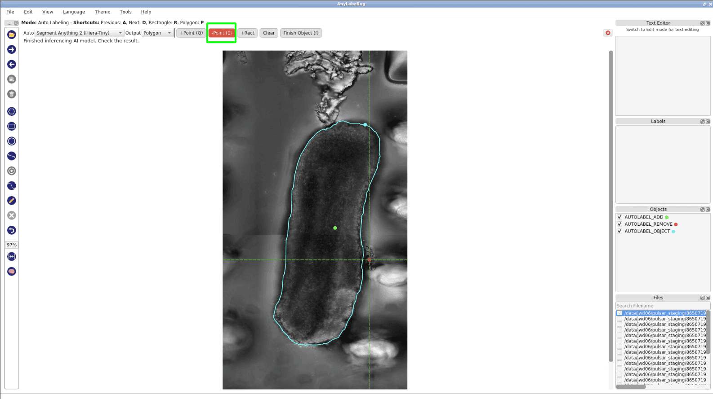
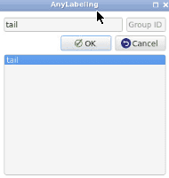

In bioimages, challenging morphologies are often quite hard to segment using traditional computer vision/image analysis methods. Therefore, using semi-supervised machine learning or deep learning for such tasks is getting more popular. 

This tutorial shows an easy-to-use and efficient workflow of training YOLO models in Galaxy. The workflow integrates both interactive and headless tools. We demonstrate the workflow here with bright field images of tails. The workflow can also be adapted to other datasets with minimal adjustments.

> <agenda-title></agenda-title>
>
> In this tutorial, we will cover:
>
> 1. TOC
> {:toc}
>
{: .agenda}

# Get data

> <hands-on-title> Data Upload </hands-on-title>
>
> 1. Create a new history for this tutorial
>   
> 2. Import the following dataset from [Zenodo](https://zenodo.org/record/16096782) or from the data library.
>    - **Important:** Choose the type of data as `zip`.
>
>    ```
>    https://zenodo.org/records/16096782/files/example-input-images.zip
>    ```
>
>    
>
>    
>
> 3.  with the following parameters:
>    -  *"input_file"*: `example-input-images.zip`
>    - *"Extract single file"*: `All files`
>    - Click on **Edit**  next to the collection name in your history to rename it to `input-images`
>
> 4. Import the class name file from [Zenodo](https://zenodo.org/record/16096782)
> 
>    ```
>    https://zenodo.org/records/16096782/files/class_names.txt
>    ```
>    
>    
>
> 5. Inspect the content of `class_names.txt`.
>    - Click on the title of your file to see the row of small icons for saving, linking, etc.:
> 
>    - Click on the **visualise icon**  and then select the **Editor** visualization plugin.
{: .hands_on}

> <question-title></question-title>
>  
> 1. How many classes are there in this class file?
> 2. What are the class names?
>
> > <solution-title></solution-title>
> >
> >  1. 1
> >  2. tail
> >
> {: .solution}
>
{: .question}


# Preprocessing the images 

The example dataset used in this tutorial consists of images in TIFF format. However, the YOLO training tool in Galaxy currently supports only JPEG (JPG) images. Therefore, as a necessary preprocessing step, the input images must be converted to the appropriate format. In this workflow, we first do contrast enhancement using adaptive histogram equalization of the images and then convert them from TIFF to JPG.

It's important to note that these preprocessing steps are tailored to the example data. When applying this workflow to other images, the specific preprocessing steps may vary. Format conversion is mandatory if the images are not already in JPG, but contrast enhancement or other adjustments may or may not be needed depending on images. Users should adapt this part of the workflow to best suit their own data.

## Perform contrast enhancement

> <hands-on-title> Normalize Histogram </hands-on-title>
>
> 1.  with the following parameters:
>    -  *"Input image"*: `input-images` (Input dataset collection)
>    - *"Histogram equalization algorithm"*: `CLAHE`
> 2. Rename  the output collection to `input-normalized`.
{: .hands_on}


## Convert image format

> <hands-on-title> Convert Format </hands-on-title>
>
> 1.  with the following parameters:
>    -  *"Image to convert"*: `input-normalized` (Input dataset collection, output of **Perform histogram equalization** )
>    - *"Transformations"*: `Deselect all`
>    - *"Reduce Color Palette"*: `No`
>    - *"Resize(%)"*: `100.0`
>    - *"Output Format"*: `jpg`
> 2. Rename  the output collection to `input-converted`.
{: .hands_on}


# Annotating the images
Once the input images are preprocessed and converted to JPG format, we need to annotate the images. AnyLabeling is an interactive labeling tool integrated into Galaxy that allows users to draw bounding boxes or other shapes around objects of interest. 

In this tutorial, we annotate all 22 example images using the tool's `Auto labeling` function, which helps accelerate the annotation process. The label files generated from AnyLabeling will later be used to train a YOLO model. The annotation process is entirely human-in-the-loop, so the quality and relevance of the labels directly influence the performance of the resulting model. 

> <hands-on-title> Interactive Annotation </hands-on-title>
>
> 1. Start  with the following parameters:
>    -  *"Input images"*: `input-converted` (Input dataset collection, output of **Convert image format** )
>    - *"Pre-existing annotations"*: `Empty`
>    - *"Classes file"*: `Empty`
>    - *"A tarball containing custom model files and yaml files"*: `Empty`
>
>    
>
> 2. Once AnyLabeling is open.
>    - Navigate to `File` -> `Change Output Dir` and set the output directory to `working/home/output`.
> {: width="75%"}
>
>    - To open your input images, go to `File` -> `Open Dir`, and choose `working/home/input_images` directory.
>
> {: width="75%"}
>
>    - Click the `Auto Labeling` button, choose `Segment Anything 2 (Hiera-Tiny)` from the model dropdown, select `+Point`,then begin annotation by clicking on the object in the image. Wait for the inference to complete before continuing.
>
> {: width="75%"}
>
>    **Note:** If the selected auto labeling model detects background or object not part of the object of interest, we can refine it by adding a negative prompt to the image where it detects background. Vice versa, if the model does not completely detect the boundaries of the objects, one can add a positive prompt to the areas inside object that were missed by the model. 
>    - In the previous step, the results included some background, as shown in the picture. To refine them, click `-Point`, then click on the background area. The model will re-run the inference.
>
> {: width="75%"}
>    - After the inference is complete, click `Finish Object`. In the `Enter object label` box, type `tail` then click `OK`. This will automatically create a label file in json format that contains the x,y coordinates of the polygon.
>
> {: width="75%"}
>
>    - **Important:** The object label must match the content of `class_names.txt`.
>    - Repeat these steps for each image in the dataset to complete the interactive annotation process. 
>
{: .hands_on}


# Prepare training data
In this step, we will convert the annotation file generated by AnyLabeling (in JSON format) into YOLO compatible txt files. This conversion is necessary because the YOLO training tool expects annotations in its specific text format, where each object is described by a class ID and corresponding bounding box coordinates. The YOLO txt file must be formatted according to the described [specifications](https://roboflow.com/formats/yolo).

> <hands-on-title></hands-on-title>
> 
> 1.  with the following parameters:
>    -  *"Input label files"*: `al_output` (output of **AnyLabeling Interactive** )
>    -  *"Class file"*: `class_names.txt` (Input dataset)
>
> 2. Rename  the output collection to `yolo-files`
{: .hands_on}


# Train a YOLO model

> <hands-on-title> </hands-on-title>
> In this step, we will train a custom YOLO model for segmentation using the prepared images and annotation files.
> 1.  with the following parameters:
>    -  *"Input images"*: `input-converted` (output of **Convert image format** )
>    -  *"Input YOLO txt files"*: `yolo-files` (output of **Convert AnyLabeling JSON to YOLO text** )
>    -  *"Model URL"*: `YOLO11n-seg` 
>    - In *"Training Parameters"*:
>        - *"How do you want to split your images for training."*: `70`
>        - *"Number of epochs for taining."*: `50`
>        - *"Image size"*: `512`
>        - *"Image scale augmentation"*: `0.8`
>        - *"Image rotation augmentation"*: `10.0`
>        - *"Image HSV-Value"*: `0.5`
>        - *"Image HSV-Saturation"*: `0.7`
>        - *"Image HSV-Hue"*: `0.015`
>        - *"Learning rate"*: `0.02`
>        - *"Weight decay"*: `0.001`
>        - *"Confidence"*: `0.5`
>        - *"IoU (Intersection over union)"*: `0.7`
>        - *"Max. number of detection"*: `300`
>
>
{: .hands_on}

> <question-title></question-title>
>
> 1. What output files are generated after training?
> 2. How do training parameters affect model performance?
> 3. What happen if the *Confidence* threshold increase or decrease?
>
> > <solution-title></solution-title>
> >
> > 1. The training step produces the best model, last model, training metrics, and a training plot.
> > 2. **Number of epochs**: A higher number allows the model to learn more thoroughly but takes longer. 
> >
> >    **Image size**: Determines the resolution used during training. Larger sizes can improve accuracy but require more memory and time.
> >
> >    **Image scale augmentation**: Resizes images by a random factor within the specified range. The scale hyperparameter defines the scaling factor, with the final adjustment randomly chosen between 1-scale and 1+scale. For example, with scale=0.5, the scaling is randomly selected within 0.5 to 1.5.
> >
> >    **Image rotation augmentation**: Rotates images randomly within the specified range. The degrees hyperparameter defines the rotation angle, with the final adjustment randomly chosen between -degrees and degrees. For example, with degrees=10.0, the rotation is randomly selected within -10.0 to 10.0.
> >
> >    **Image HSV-Value**: Changes the brightness of the image. The hsv_v hyperparameter defines the shift magnitude, with the final adjustment randomly chosen between -hsv_v and hsv_v. For example, with hsv_v=0.4, the intensity is randomly selected within -0.4 to 0.4.
> >
> >    **Learning rate**: Controls how fast the model learns. If training is unstable or not improving, try lowering this (e.g., to 0.01 or 0.005).
> >
> >    **Weight decay**: Helps prevent overfitting by penalizing large weights. Usually works well between 0.0001 and 0.01.
> > 3. This value sets the minimum confidence threshold for detections. Objects detected with confidence below this threshold will be disregarded. Adjusting this value can help reduce false positives.
> >
> {: .solution}
>
{: .question}

# Extract complete training workflow from history
As an optional step, you can extract a complete workflow from your Galaxy history. This allows you to save and reuse the entire training process as a reproducible and shareable workflow.



# Using the trained model to label new images
Once training is complete, the resulting model can be used to label new images. The process of applying the trained model for inference is covered in a separate tutorial. Please refer to that tutorial for detailed instructions on how to use the model for prediction.


# Conclusion

This tutorial demonstrated how to train a custom YOLO model for segmentation in bioimages using Galaxy. By combining image preprocessing, human-in-the-loop annotation, format conversion, and model training, we have built a complete workflow. We can apply the trained model to new image data and further refine our workflow as needed.
