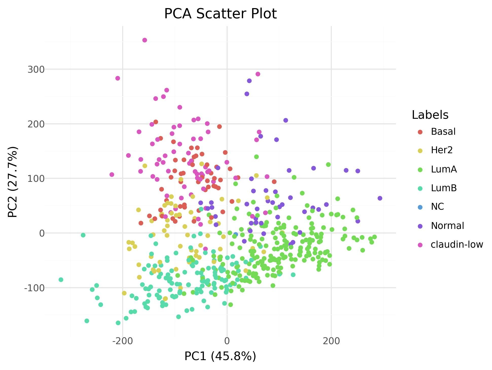
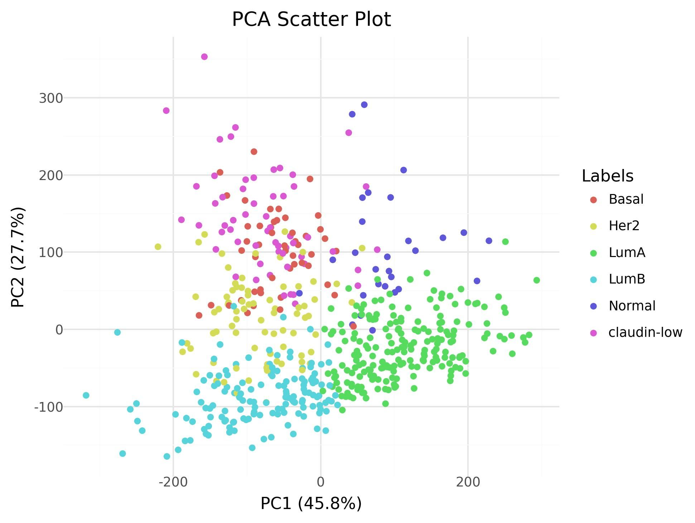
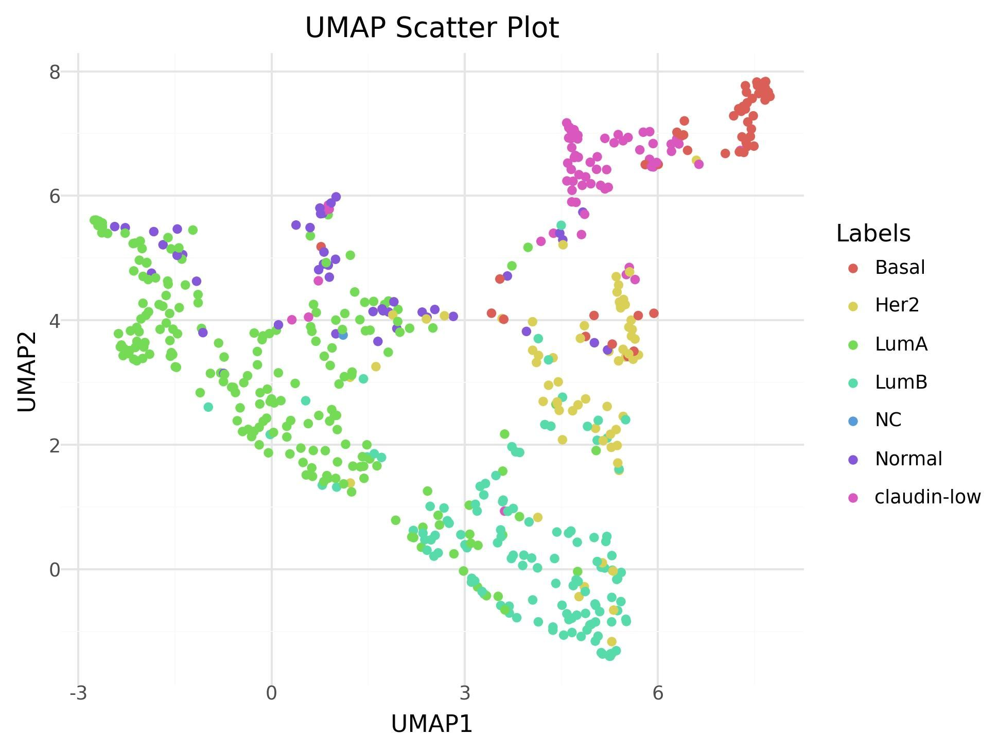
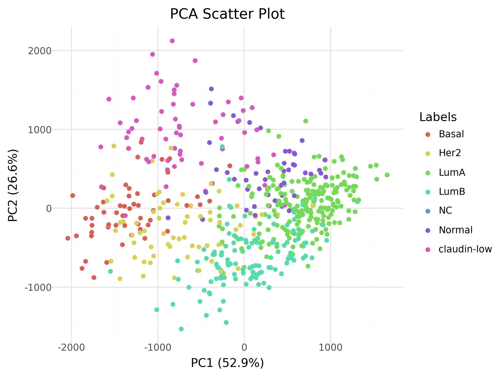
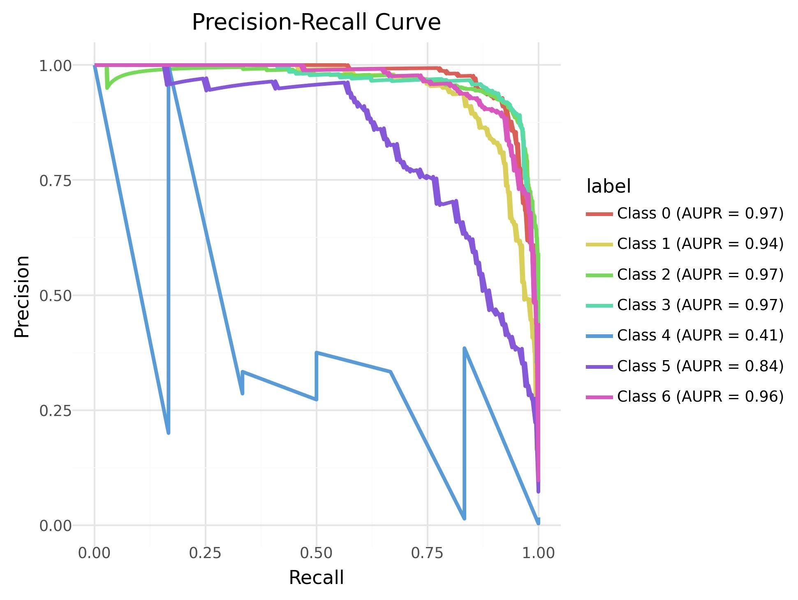
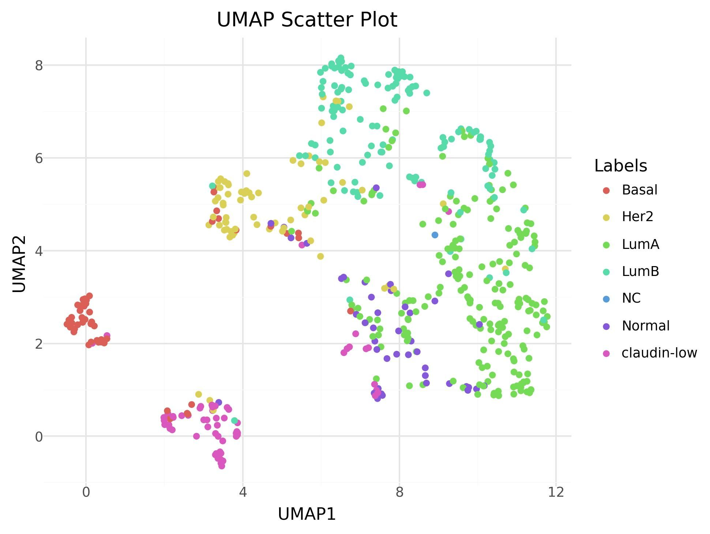
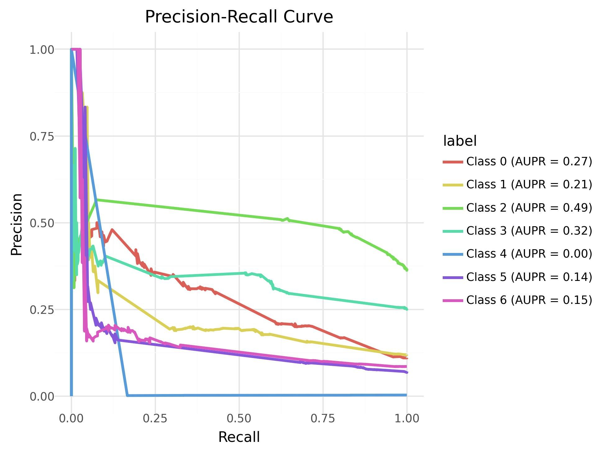
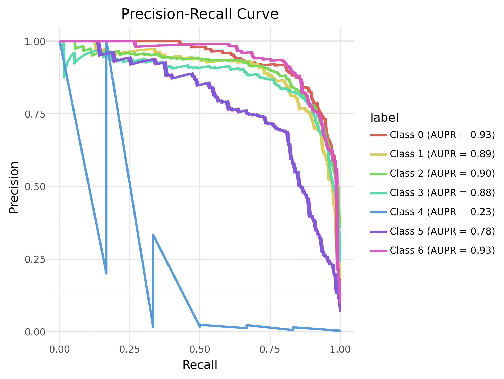
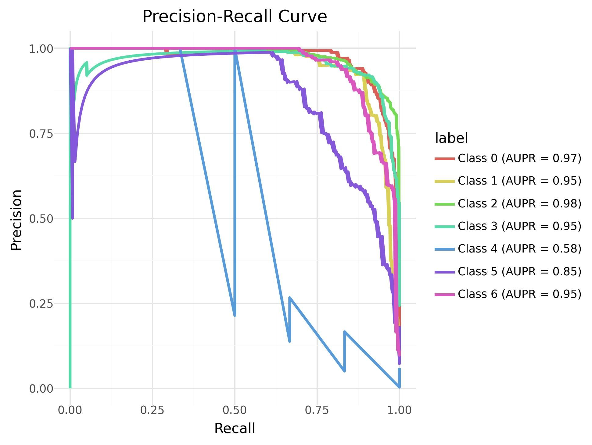

Flexynesis represents a state-of-the-art deep learning framework specifically designed for multi-modal data integration in biological research (). What sets Flexynesis apart is its comprehensive suite of deep learning architectures that can handle various data integration scenarios while providing robust feature selection and hyperparameter optimization.

Here, we use Flexynesis tool suite on a multi-omics dataset of Breast Cancer samples from the METABRIC consortium (), one of the landmark breast cancer genomics studies available through cBioPortal (). This dataset contains comprehensive molecular and clinical data from over 2,000 breast cancer patients, including gene expression profiles, copy number alterations, mutation data, and clinical outcomes. The data was downloaded from Cbioportal and randomly split into train (70% of the samples) and test (30% of the samples) data folders. The data files were processed to follow the same nomenclature.

This training is inspired from the original Flexynesis analysis notebook: [brca_subtypes.ipynb](https://github.com/BIMSBbioinfo/flexynesis/blob/main/examples/tutorials/brca_subtypes.ipynb).

> <warning-title>LICENSE</warning-title>
>
> Flexynesis is only available for NON-COMMERCIAL use. Permission is only granted for academic, research, and educational purposes. Before using, be sure to review, agree, and comply with the license.
> For commercial use, please review the Flexynesis license on GitHub and contact the [copyright holders](https://github.com/BIMSBbioinfo/flexynesis)
{: .warning}

> <agenda-title></agenda-title>
>
> In this tutorial, we will cover:
>
> 1. TOC
> {:toc}
>
{: .agenda}

# Get data

In this training we will use a multi-omics dataset from the METABRIC database downloaded through cBioPortal and split to 70% train and 30% test samples.

The multi-omics data consists of three data types:

- **Gene Expression (GEX)**: Measures the activity levels of genes by quantifying mRNA abundance. This data captures which genes are being actively transcribed in each sample.

- **Copy Number Alterations (CNA)**: Detects genomic regions that have been duplicated or deleted compared to the normal genome. Cancer cells often have chromosomal instabilities leading to gene amplifications (gains) or deletions (losses), which can drive tumor development and progression.

- **Clinical data (CLIN)**: Contains patient metadata including demographics, treatment history, tumor characteristics, and importantly for this tutorial, the breast cancer molecular subtypes (such as Luminal A, Luminal B, HER2-enriched, and Basal-like) subtypes based on the expression patterns of key biomarkers including claudin proteins, which are important for cell adhesion and tumor behavior.

These three data modalities provide complementary views of the same tumor samples - the clinical data provides the biological context and classification labels, while the molecular data (GEX and CNA) capture the underlying genomic alterations that drive these clinical phenotypes.

Flexynesis tries to learn the patterns in these molecular alterations and connect them to the phenotype to predict cancer subtypes based on the genomic and transcriptomic profiles.

> <hands-on-title> Data Upload </hands-on-title>
>
> 1. Create a new history for this tutorial
> 2. Import the files from [Zenodo]({{ page.zenodo_link }}) or from
>    the shared data library (`GTN - Material` -> `{{ page.topic_name }}`
>     -> `{{ page.title }}`):
>
>    ```
>    https://zenodo.org/records/16287482/files/train_cna_brca.tabular
>    https://zenodo.org/records/16287482/files/train_gex_brca.tabular
>    https://zenodo.org/records/16287482/files/train_clin_brca.tabular
>    https://zenodo.org/records/16287482/files/test_cna_brca.tabular
>    https://zenodo.org/records/16287482/files/test_gex_brca.tabular
>    https://zenodo.org/records/16287482/files/test_clin_brca.tabular
>    ```
>
>    
>
>    
>
> 3. Rename the datasets
> 4. Check that the datatype is `tabular`
>
>    
>
> 5. Add to each database a tag corresponding to the modality (#gex, #cna, #clin)
>
>    
>
{: .hands_on}


# Classification task with Flexynesis (1 iteration)

Flexynesis automatically handles key preprocessing steps such as:

* Data processing:
  * removing uninformative features (e.g. features with near-zero-variation)
  * removing samples with too many NA values
  * removing features with too many NA values and impute remaining NA values using median imputation (replacing missing values with the median of each feature)

* Feature selection **only on training data** for each omics layer separately:
  * Features are sorted by Laplacian score
  * Features that make it in the `top_percentile`
  * Highly redundant features are further removed (for a pair of highly correlated features, keep the one with the higher laplacian score).

* Harmonize the training data with the test data

* Normalize the datasets (Subset the test data features to those that are kept for training data)

* Normalize training data (standard scaling) and apply the same scaling factors to the test data.

* Log transform the final matrices (Optional)

* Distinguish numerical and categorical variables in the clinical data file. For categorical variables, create a numerical encoding of the labels for training data. Use the same encoders to map the test samples to the same numerical encodings.

>    > <comment-title> No manual preprocessing is required </comment-title>
>    >
>    > Flexynesis performs all data cleaning internally as part of its pipeline.
>    {: .comment}

Now it's time to train model using Flexynesis:
* We choose whether we want to concatenate the data matrices (early integration) or not (intermediate integration) before running them through the neural networks.
* We want to apply feature selection and keep only top 10% of the features. In the end, we want to keep at least 1000 features per omics layer.
* We apply a variance threshold (for simplicity of demonstration, we want to keep a few most variable features). Setting this to 80, will remove 80% of the features with the lowest variation from each modality.
* We choose which model architecture to use:
  * DirectPred: a fully connected network (standard multilayer perceptron) with supervisor heads (one MLP for each target variable)
* `target_variables`: Column headers in clinical data.
* `hpo_iter`: How many hyperparameter search steps to implement:
  * This example runs 1 hyperparameter search step using DirectPred architecture and a hyperparameter configuration space defined for "DirectPred" with a supervisor head for "CLAUDIN_SUBTYPE" variable. At the end of the parameter optimization, the best model will be selected and returned.

Training a model longer than needed causes the model to overfit, yield worse validation performance, and also it takes a longer time to train the models, considering if we have to run a long hyperparameter optimization routine, not just for 1 step, but say more than 100 steps.

It is possible to set early stopping criteria in Flexynesis, which is basically a simple callback that is handled by `Pytorch Lightning`. This is regulated using the `early_stop_patience`. When set to e.g. 10, the training will stop if the validation loss has not been improved in the last 10 epochs.

> <hands-on-title> Flexynesis </hands-on-title>
>
> 1.  with the following parameters:
>    - *"I certify that I am not using this tool for commercial purposes."*: `Yes`
>    - *"Type of Analysis"*: `Supervised training`
>        -  *"Training clinical data"*: `train_clin_brca.tabular`
>        -  *"Test clinical data"*: `test_clin_brca.tabular`
>        -  *"Training omics data"*: `train_gex_brca.tabular`
>        -  *"Test omics data"*: `test_gex_brca.tabular`
>        - *"What type of assay is your input?"*: `gex`
>        - In *"Multiple omics layers?"*:
>            -  *"Insert Multiple omics layers?"*
>                -  *"Training omics data"*: `train_cna_brca.tabular`
>        -  *"Test clinical data"*: `test_cna_brca.tabular`
>                - *"What type of assay is your input?"*: `cna`
>        - *"Model class"*: `DirectPred`
>        - *"Column name in the train clinical data to use for predictions, multiple targets are allowed"*: `Column: 16` (CLAUDIN_SUBTYPE)
>        - In *"Advanced Options"*:
>            - *"Fusion method"*: `intermediate`
>            - *"Variance threshold (as percentile) to drop low variance features."*: `0.8`
>            - *"Minimum number of features to retain after feature selection."*: `100`
>            - *"Top percentile features (among the features remaining after variance filtering and data cleanup) to retain after feature selection."*: `10.0`
>            - *"Number of iterations for hyperparameter optimization."*: `1`
>        - In *"Visualization"*:
>            - *"Generate embeddings plot?"*: `Yes`
>            - *"Generate precision-recall curves plot?"*: `Yes`
>
{: .hands_on}

> <question-title></question-title>
>
> 1. What are main outputs of Flexynesis?
> 2. What does the generated plots show?
>
> > <solution-title></solution-title>
> >
> > 1. The results collection contains the following data:
> > * job.embeddings_test (latent space of test data)
> > * job.embeddings_train (latent space of train data)
> > * job.feature_importance.GradientShap (feature importance calculated by GradientShap method)
> > * job.feature_importance.IntegratedGradients (feature importance calculated by IntegratedGradients method)
> > * job.feature_logs.cna
> > * job.feature_logs.gex
> > * job.predicted_labels (Prediction of the created model)
> > * job.stats
> >
> > 2. There are three figures in plot collection:
> > * A PCA plot of the Embeddings colored by known, true subtypes
> > 
> > * A PCA plot of the Embeddings colored by predicted subtypes
> > 
> > We can see that the subtypes were predicted by the model with a good approximation.
> > * A precision-recall curves plot, showing the accuracy of the prediction
> > 
> > This plot also conforms that most of the subtypes were classified with a good precision (except Class 4 (LumB), in the PCA plot you can see some Her2 samples were classified as LumB for example)
> {: .solution}
>
{: .question}

## Generate UMAP plot of the embeddings

To generate a UMAP plot, we need to extract the embeddings and predicted table.

> <hands-on-title> Extract embeddings and prediction </hands-on-title>
>
> 1.  with the following parameters:
>    -  *"Input List"*: `results` (output of **Flexynesis** )
>    - *"How should a dataset be selected?"*: `Select by element identifier`
>        - *"Element identifier:"*: `job.embeddings_test`
>
> 2.  with the following parameters:
>    -  *"Input List"*: `results` (output of **Flexynesis** )
>    - *"How should a dataset be selected?"*: `Select by element identifier`
>        - *"Element identifier:"*: `job.predicted_labels`
>
{: .hands_on}

> <question-title></question-title>
>
> 1. What information do we have in predicted labels?
>
> > <solution-title></solution-title>
> >
> > 1. It is a tabular file which contains the probability of each subtype for each sample and a final predicted label based on the probability.
> >
> {: .solution}
>
{: .question}

As you have seen in predicted labels, each sample has a prediction value for each subtype. For UMAP plot we only need the final predicted label.

> <hands-on-title> Remove probabilities (duplicates) </hands-on-title>
>
> 1.  with the following parameters:
>    - *"Sort Query"*: `job.predicted_labels` (output of **Extract dataset** )
>    - *"Number of header lines"*: `1`
>    - In *"Column selections"*:
>        -  *"Insert Column selections"*
>            - *"on column"*: `Column: 1`
>            - *"Flavor"*: `Alphabetical sort `
>    - *"Output unique values"*: `Yes`
>
{: .hands_on}

And finally the UMAP plot.

> <hands-on-title> UMAP plot </hands-on-title>
>
> 1.  with the following parameters:
>    - *"I certify that I am not using this tool for commercial purposes."*: `Yes`
>    - *"Flexynesis plot"*: `Dimensionality reduction`
>        -  *"Predicted labels"*: `table` (output of **Sort** )
>        -  *"Embeddings"*: `job.embeddings_test` (output of **Extract dataset** )
>        - *"Column in the labels file to use for coloring the points in the plot"*: `Column: 5`
>        - *"Transformation method"*: `UMAP`
>
{: .hands_on}

> <question-title></question-title>
>
> 1. What does the generated plot show?
>
> > <solution-title></solution-title>
> >
> > 
> >
> > This is a UMAP representation of the embeddings which shows a better speration between subtypes
> >
> {: .solution}
>
{: .question}

# Longer training

In reality, hyperparameter optimization should run for multiple steps so that the parameter search space is large enough to find a good set. However, for demonstration purposes, we only run it for 5 steps here:
- *"Number of iterations for hyperparameter optimization."*: `5`

> <hands-on-title> Flexynesis </hands-on-title>
>
> 1.  with the following parameters:
>    - *"I certify that I am not using this tool for commercial purposes."*: `Yes`
>    - *"Type of Analysis"*: `Supervised training`
>        -  *"Training clinical data"*: `train_clin_brca.tabular`
>        -  *"Test clinical data"*: `test_clin_brca.tabular`
>        -  *"Training omics data"*: `train_gex_brca.tabular`
>        -  *"Test omics data"*: `test_gex_brca.tabular`
>        - *"What type of assay is your input?"*: `gex`
>        - In *"Multiple omics layers?"*:
>            -  *"Insert Multiple omics layers?"*
>                -  *"Training omics data"*: `train_cna_brca.tabular`
>        -  *"Test clinical data"*: `test_cna_brca.tabular`
>                - *"What type of assay is your input?"*: `cna`
>        - *"Model class"*: `DirectPred`
>        - *"Column name in the train clinical data to use for predictions, multiple targets are allowed"*: `Column: 16` (CLAUDIN_SUBTYPE)
>        - In *"Advanced Options"*:
>            - *"Fusion method"*: `intermediate`
>            - *"Variance threshold (as percentile) to drop low variance features."*: `0.8`
>            - *"Minimum number of features to retain after feature selection."*: `100`
>            - *"Top percentile features (among the features remaining after variance filtering and data cleanup) to retain after feature selection."*: `10.0`
>            - *"Number of iterations for hyperparameter optimization."*: `5`
>        - In *"Visualization"*:
>            - *"Generate embeddings plot?"*: `Yes`
>            - *"Generate precision-recall curves plot?"*: `Yes`
>
{: .hands_on}

> <question-title></question-title>
>
> 1. What does the generated plots show?
>
> > <solution-title></solution-title>
> >
> > 1. There are three figures in plot collection:
> > * A PCA plot of the Embeddings colored by known, true subtypes
> > 
> > * A PCA plot of the Embeddings colored by predicted subtypes
> > 
> > We can see that the subtypes were predicted by the model with a good approximation.
> > * A precision-recall curves plot, showing the accuracy of the prediction
> > 
> > This plot also conforms that most of the subtypes were classified with a good precision. Also the precision has incresed (compare Class4 = 0.23 with 1 iteration to Class4 = 0.41 with 5 iterations)
> {: .solution}
>
{: .question}

## Generate UMAP plot of the embeddings

To generate a UMAP plot, we need to extract the embeddings and predicted table.

> <hands-on-title> Extract embeddings and prediction </hands-on-title>
>
> 1.  with the following parameters:
>    -  *"Input List"*: `results` (output of **Flexynesis** )
>    - *"How should a dataset be selected?"*: `Select by element identifier`
>        - *"Element identifier:"*: `job.embeddings_test`
>
> 2.  with the following parameters:
>    -  *"Input List"*: `results` (output of **Flexynesis** )
>    - *"How should a dataset be selected?"*: `Select by element identifier`
>        - *"Element identifier:"*: `job.predicted_labels`
>
{: .hands_on}

> <hands-on-title> Remove probabilities (duplicates) </hands-on-title>
>
> 1.  with the following parameters:
>    - *"Sort Query"*: `job.predicted_labels` (output of **Extract dataset** )
>    - *"Number of header lines"*: `1`
>    - In *"Column selections"*:
>        -  *"Insert Column selections"*
>            - *"on column"*: `Column: 1`
>            - *"Flavor"*: `Alphabetical sort `
>    - *"Output unique values"*: `Yes`
>
{: .hands_on}

And finally the UMAP plot.

> <hands-on-title> UMAP plot </hands-on-title>
>
> 1.  with the following parameters:
>    - *"I certify that I am not using this tool for commercial purposes."*: `Yes`
>    - *"Flexynesis plot"*: `Dimensionality reduction`
>        -  *"Predicted labels"*: `table` (output of **Sort** )
>        -  *"Embeddings"*: `job.embeddings_test` (output of **Extract dataset** )
>        - *"Column in the labels file to use for coloring the points in the plot"*: `Column: 5`
>        - *"Transformation method"*: `UMAP`
>
{: .hands_on}

> <question-title></question-title>
>
> 1. What does the generated plot show?
>
> > <solution-title></solution-title>
> >
> > 
> >
> > This is a UMAP representation of the embeddings which shows a better speration between subtypes
> >
> {: .solution}
>
{: .question}



<div class="Ill-try-later" markdown="1">

# Conclusion

In this tutorial, we demonstrated how Flexynesis can model breast cancer subtypes from multi omics data using a deep generative framework. The tool handles preprocessing, feature selection, and latent space learning automatically, making it efficient and robust.

By training on TCGA BRCA data, we:

  * Visualized meaningful subtype separation in the latent space

  * Identified subtype-specific genes

  * Showed how learned features relate to known clinical labels

Flexynesis provides an accessible way to explore complex omics datasets and uncover biological structure without extensive manual tuning.
</div>

<div class="Lets-try-TabPFN" markdown="1">

Alright, Let's see how TabPFN can predict the subtypes

# Prepare data for TabPFN

Currently, TabPFN supports up to **10,000** samples and **500** features (genes) in a tabular data.
We will filter our data by gene variance and will use top 500 variable genes as input for TabPFN.

The train and test tabular data for TabPFN should be transposed so the samples are in rows and genes in columns, the last column should contain the labels and train and test data should have **same** set of features in **same** order.

Since TabPFN does not support data integration, we should try gene expression and copy number alteration data separately.

## CNA data

First, let's filter the cna data by variance.

> <hands-on-title> Prepare CNA data </hands-on-title>
>
> > <comment-title> Short explanation of steps: </comment-title>
> > Here we will:
> > * Calculate the variance of each gene in train matrix
> > * Add the variance back to the matrix
> > * Sort the matrix by variance in descending order
> > * Filter the matrix by top 500 genes
> > * Sort the matrix by gene name
>    {: .comment}
>
> 1.  with the following parameters:
>    - *"Input Single or Multiple Tables"*: `Single Table`
>        -  *"Table"*: `train_cna_brca.tabular`
>        - *"Type of table operation"*: `Compute expression across rows or columns`
>            - *"Calculate"*: `Variance`
>            - *"For each"*: `Row`
>
> 2.  with the following parameters:
>    -  *"Join"*: `table` (output of **Table Compute** )
>    - *"using column"*: `Column: 1`
>    -  *"with"*: `train_cna_brca.tabular`
>    - *"and column"*: `Column: 1`
>    - *"Fill empty columns"*: `No`
>    - *"Keep the header lines"*: `Yes`
>
> 3.  with the following parameters:
>    -  *"Sort Query"*: `table` (output of **Join two Datasets** )
>    - *"Number of header lines"*: `1`
>    - In *"Column selections"*:
>        -  *"Insert Column selections"*
>            - *"on column"*: `Column: 2`
>            - *"in"*: `Descending order`
>            - *"Flavor"*: `Fast numeric sort (-n) `
>
> 4.  with the following parameters:
>    - *"Select first"*: `500`
>    -  *"from"*: `table` (output of **Sort** )
>    - *"Dataset has a header"*: `Yes`
>
> 5.  with the following parameters:
>    -  *"File to cut"*: `table` (output of **Select first** )
>    - *"Operation"*: `Discard`
>    - *"Cut by"*: `fields`
>        - *"Is there a header for the data's columns ?"*: `Yes`
>            - *"List of Fields"*: `Column: 1`, `Column: 2`
>
> 6.  with the following parameters:
>    -  *"Sort Query"*: `table` (output of **Advanced Cut** )
>    - *"Number of header lines"*: `1`
>    - In *"Column selections"*:
>        -  *"Insert Column selections"*
>            - *"on column"*: `Column: 1`
>            - *"Flavor"*: `Alphabetical sort `
>
> 7. Rename the output file to `train_cna_brca_500gene.tabular`
>
> > <comment-title> Short explanation of steps: </comment-title>
> > Here we will:
> > * Extract the list of genes from the train matrix
> > * Filter the test data by extracted genes
> > * Sort the matrix by gene name
> > * Transpose both train and test data
>    {: .comment}
>
> 1.  with the following parameters:
>    -  *"File to cut"*: `train_cna_brca_500gene.tabular` (output of **Advanced Cut** )
>    - *"Operation"*: `Keep`
>    - *"Cut by"*: `fields`
>        - *"Is there a header for the data's columns ?"*: `Yes`
>            - *"List of Fields"*: `Column: 1`
>
> 2.  with the following parameters:
>    -  *"1st file"*: `table` (output of **Advanced Cut** )
>    - *"Column to use from 1st file"*: `Column: 1`
>    -  *"2nd File"*: `test_cna_brca.tabular`
>    - *"Column to use from 2nd file"*: `Column: 1`
>    - *"First line is a header line"*: `Yes`
>
> 3.  with the following parameters:
>    -  *"Sort Query"*: `output` (output of **Join** )
>    - *"Number of header lines"*: `1`
>    - In *"Column selections"*:
>        -  *"Insert Column selections"*
>            - *"on column"*: `Column: 1`
>            - *"Flavor"*: `Alphabetical sort `
>
> 4. Rename the output file to `test_cna_brca_500gene.tabular`
>
> 5.  with the following parameters:
>    -  *"Input tabular dataset"*: `train_cna_brca_500gene.tabular` (output of **Sort** )
>
> 4. Rename the output file to `train_cna_brca_500gene_transposed.tabular`
>
> 6.  with the following parameters:
>    -  *"Input tabular dataset"*: `test_cna_brca_500gene.tabular` (output of **Sort** )
>
> 4. Rename the output file to `test_cna_brca_500gene_transposed.tabular`
>
> > <comment-title> Short explanation of steps: </comment-title>
> > Here we will:
> > * Extract `sample_id` and `CLAUDIN_SUBTYPE` from the train and clinical data
> > * Add the subtype to the train and test matrix
> > * And finally remove the `sample_id` from the matrices.
>    {: .comment}
>
> 1.  with the following parameters:
>    -  *"File to cut"*: `train_clin_brca.tabular` (Input dataset)
>    - *"Operation"*: `Keep`
>    - *"Cut by"*: `fields`
>        - *"Is there a header for the data's columns ?"*: `Yes`
>            - *"List of Fields"*: `Column: 1`, `Column: 16`
>
> 2. Rename the output to `Train annotation`
>
> 3.  with the following parameters:
>    -  *"File to cut"*: `test_clin_brca.tabular` (Input dataset)
>    - *"Operation"*: `Keep`
>    - *"Cut by"*: `fields`
>        - *"Is there a header for the data's columns ?"*: `Yes`
>            - *"List of Fields"*: `Column: 1`, `Column: 16`
>
> 2. Rename the output to `Test annotation`
>
> 3.  with the following parameters:
>    -  *"1st file"*: `train_cna_brca_500gene_transposed.tabular` (output of **Transpose** )
>    - *"Column to use from 1st file"*: `Column: 1`
>    -  *"2nd File"*: `Train annotation` (output of **Advanced Cut** )
>    - *"Column to use from 2nd file"*: `Column: 1`
>    - *"First line is a header line"*: `Yes`
>
> 2. Rename the output to `Annotated train matrix cna`
>
> 3.  with the following parameters:
>    -  *"1st file"*: `test_cna_brca_500gene_transposed.tabular` (output of **Transpose** )
>    - *"Column to use from 1st file"*: `Column: 1`
>    -  *"2nd File"*: `Test annotation` (output of **Advanced Cut** )
>    - *"Column to use from 2nd file"*: `Column: 1`
>    - *"First line is a header line"*: `Yes`
>
> 2. Rename the output to `Annotated test matrix`
>
> 1.  with the following parameters:
>    -  *"File to cut"*: `Annotated train matrix` (output of **Join** )
>    - *"Operation"*: `Discard`
>    - *"Cut by"*: `fields`
>        - *"Is there a header for the data's columns ?"*: `Yes`
>            - *"List of Fields"*: `Column: 1`
>
> 2. Rename the output to `TabPFN ready train data - CNA`
>
> 1.  with the following parameters:
>    -  *"File to cut"*: `Annotated test matrix` (output of **Join** )
>    - *"Operation"*: `Discard`
>    - *"Cut by"*: `fields`
>        - *"Is there a header for the data's columns ?"*: `Yes`
>            - *"List of Fields"*: `Column: 1`
>
> 2. Rename the output to `TabPFN ready test data - CNA`
{: .hands_on}

Now the CNA data is ready for TabPFN. Let's do the same for GEX!

## GEX data

> <hands-on-title> Prepare GEX data </hands-on-title>
>
> > <comment-title> Short explanation of steps: </comment-title>
> > Here we will:
> > * Calculate the variance of each gene in train matrix
> > * Add the variance back to the matrix
> > * Sort the matrix by variance in descending order
> > * Filter the matrix by top 500 genes
> > * Sort the matrix by gene name
>    {: .comment}
>
> 1.  with the following parameters:
>    - *"Input Single or Multiple Tables"*: `Single Table`
>        -  *"Table"*: `train_gex_brca.tabular`
>        - *"Type of table operation"*: `Compute expression across rows or columns`
>            - *"Calculate"*: `Variance`
>            - *"For each"*: `Row`
>
> 2.  with the following parameters:
>    -  *"Join"*: `table` (output of **Table Compute** )
>    - *"using column"*: `Column: 1`
>    -  *"with"*: `train_gex_brca.tabular`
>    - *"and column"*: `Column: 1`
>    - *"Fill empty columns"*: `No`
>    - *"Keep the header lines"*: `Yes`
>
> 3.  with the following parameters:
>    -  *"Sort Query"*: `table` (output of **Join two Datasets** )
>    - *"Number of header lines"*: `1`
>    - In *"Column selections"*:
>        -  *"Insert Column selections"*
>            - *"on column"*: `Column: 2`
>            - *"in"*: `Descending order`
>            - *"Flavor"*: `Fast numeric sort (-n) `
>
> 4.  with the following parameters:
>    - *"Select first"*: `500`
>    -  *"from"*: `table` (output of **Sort** )
>    - *"Dataset has a header"*: `Yes`
>
> 5.  with the following parameters:
>    -  *"File to cut"*: `table` (output of **Select first** )
>    - *"Operation"*: `Discard`
>    - *"Cut by"*: `fields`
>        - *"Is there a header for the data's columns ?"*: `Yes`
>            - *"List of Fields"*: `Column: 1`, `Column: 2`
>
> 6.  with the following parameters:
>    -  *"Sort Query"*: `table` (output of **Advanced Cut** )
>    - *"Number of header lines"*: `1`
>    - In *"Column selections"*:
>        -  *"Insert Column selections"*
>            - *"on column"*: `Column: 1`
>            - *"Flavor"*: `Alphabetical sort `
>
> 7. Rename the output file to `train_gex_brca_500gene.tabular`
>
> > <comment-title> Short explanation of steps: </comment-title>
> > Here we will:
> > * Extract the list of genes from the train matrix
> > * Filter the test data by extracted genes
> > * Sort the matrix by gene name
> > * Transpose both train and test data
>    {: .comment}
>
> 1.  with the following parameters:
>    -  *"File to cut"*: `train_gex_brca_500gene.tabular` (output of **Advanced Cut** )
>    - *"Operation"*: `Keep`
>    - *"Cut by"*: `fields`
>        - *"Is there a header for the data's columns ?"*: `Yes`
>            - *"List of Fields"*: `Column: 1`
>
> 2.  with the following parameters:
>    -  *"1st file"*: `table` (output of **Advanced Cut** )
>    - *"Column to use from 1st file"*: `Column: 1`
>    -  *"2nd File"*: `test_gex_brca.tabular`
>    - *"Column to use from 2nd file"*: `Column: 1`
>    - *"First line is a header line"*: `Yes`
>
> 3.  with the following parameters:
>    -  *"Sort Query"*: `output` (output of **Join** )
>    - *"Number of header lines"*: `1`
>    - In *"Column selections"*:
>        -  *"Insert Column selections"*
>            - *"on column"*: `Column: 1`
>            - *"Flavor"*: `Alphabetical sort `
>
> 4. Rename the output file to `test_gex_brca_500gene.tabular`
>
> 5.  with the following parameters:
>    -  *"Input tabular dataset"*: `train_gex_brca_500gene.tabular` (output of **Sort** )
>
> 4. Rename the output file to `train_gex_brca_500gene_transposed.tabular`
>
> 6.  with the following parameters:
>    -  *"Input tabular dataset"*: `test_gex_brca_500gene.tabular` (output of **Sort** )
>
> 4. Rename the output file to `test_gex_brca_500gene_transposed.tabular`
>
> > <comment-title> Short explanation of steps: </comment-title>
> > Here we will:
> > * Extract `sample_id` and `CLAUDIN_SUBTYPE` from the train and clinical data
> > * Add the subtype to the train and test matrix
> > * And finally remove the `sample_id` from the matrices.
>    {: .comment}
>
> 1.  with the following parameters:
>    -  *"File to cut"*: `train_clin_brca.tabular` (Input dataset)
>    - *"Operation"*: `Keep`
>    - *"Cut by"*: `fields`
>        - *"Is there a header for the data's columns ?"*: `Yes`
>            - *"List of Fields"*: `Column: 1`, `Column: 16`
>
> 2. Rename the output to `Train annotation`
>
> 3.  with the following parameters:
>    -  *"File to cut"*: `test_clin_brca.tabular` (Input dataset)
>    - *"Operation"*: `Keep`
>    - *"Cut by"*: `fields`
>        - *"Is there a header for the data's columns ?"*: `Yes`
>            - *"List of Fields"*: `Column: 1`, `Column: 16`
>
> 2. Rename the output to `Test annotation`
>
> 3.  with the following parameters:
>    -  *"1st file"*: `train_gex_brca_500gene_transposed.tabular` (output of **Transpose** )
>    - *"Column to use from 1st file"*: `Column: 1`
>    -  *"2nd File"*: `Train annotation` (output of **Advanced Cut** )
>    - *"Column to use from 2nd file"*: `Column: 1`
>    - *"First line is a header line"*: `Yes`
>
> 2. Rename the output to `Annotated train matrix - gex`
>
> 3.  with the following parameters:
>    -  *"1st file"*: `test_gex_brca_500gene_transposed.tabular` (output of **Transpose** )
>    - *"Column to use from 1st file"*: `Column: 1`
>    -  *"2nd File"*: `Test annotation` (output of **Advanced Cut** )
>    - *"Column to use from 2nd file"*: `Column: 1`
>    - *"First line is a header line"*: `Yes`
>
> 2. Rename the output to `Annotated test matrix - gex`
>
> 1.  with the following parameters:
>    -  *"File to cut"*: `Annotated train matrix` (output of **Join** )
>    - *"Operation"*: `Discard`
>    - *"Cut by"*: `fields`
>        - *"Is there a header for the data's columns ?"*: `Yes`
>            - *"List of Fields"*: `Column: 1`
>
> 2. Rename the output to `TabPFN ready train data - GEX`
>
> 1.  with the following parameters:
>    -  *"File to cut"*: `Annotated test matrix` (output of **Join** )
>    - *"Operation"*: `Discard`
>    - *"Cut by"*: `fields`
>        - *"Is there a header for the data's columns ?"*: `Yes`
>            - *"List of Fields"*: `Column: 1`
>
> 2. Rename the output to `TabPFN ready test data - GEX`
{: .hands_on}

Now it is time to run TabPFN for CNA and GEX data.

# TabPFN

> <warning-title>High computation time</warning-title>
>
> TabPFN takes a lot of time to do the classification task on CPU (With our data it takes about 7 hours)
> You can instead import the output (data 55,56,59, and 60) from this [archived history](https://usegalaxy.eu/u/nilchia/h/final-modeling-breast-cancer-subtypes-tabpfn-3).
{: .warning}

> <hands-on-title> TabPFN on CNA </hands-on-title>
>
> 1.  with the following parameters:
>    - *"Select a machine learning task"*: `Classification`
>    -  *"Train data"*: `TabPFN ready train data - CNA` (output of **Advanced Cut** )
>    -  *"test data"*: `TabPFN ready test data - CNA` (output of **Advanced Cut** )
>    - *"Does test data contain labels?"*: `Yes`
>
{: .hands_on}

> <hands-on-title> TabPFN on GEX </hands-on-title>
>
> 1.  with the following parameters:
>    - *"Select a machine learning task"*: `Classification`
>    -  *"Train data"*: `TabPFN ready train data - GEX` (output of **Advanced Cut** )
>    -  *"test data"*: `TabPFN ready test data - GEX` (output of **Advanced Cut** )
>    - *"Does test data contain labels?"*: `Yes`
>
{: .hands_on}

To make comparison of TabPFN and Flexynesis fair, we should apply Flexynesis on the GEX and CNA with 500 features separately.

> <hands-on-title> Flexynesis on CNA </hands-on-title>
>
> 1.  with the following parameters:
>    - *"I certify that I am not using this tool for commercial purposes."*: `Yes`
>    - *"Type of Analysis"*: `Supervised training`
>        -  *"Training clinical data"*: `train_clin_brca.tabular`
>        -  *"Test clinical data"*: `test_clin_brca.tabular`
>        -  *"Training omics data"*: `train_cna_brca_500gene.tabular` (output of **Advanced Cut** )
>        -  *"Test omics data"*: `test_cna_brca_500gene.tabular` (output of **Advanced Cut** )
>        - *"What type of assay is your input?"*: `cna`
>        - *"Model class"*: `DirectPred`
>        - *"Column name in the train clinical data to use for predictions, multiple targets are allowed"*: `Column: 16` (CLAUDIN_SUBTYPE)
>        - In *"Advanced Options"*:
>            - *"Fusion method"*: `intermediate`
>            - *"Variance threshold (as percentile) to drop low variance features."*: `0.8`
>            - *"Minimum number of features to retain after feature selection."*: `100`
>            - *"Top percentile features (among the features remaining after variance filtering and data cleanup) to retain after feature selection."*: `10.0`
>            - *"Number of iterations for hyperparameter optimization."*: `5`
>        - In *"Visualization"*:
>            - *"Generate embeddings plot?"*: `Yes`
>            - *"Generate precision-recall curves plot?"*: `Yes`
>
{: .hands_on}

> <hands-on-title> Flexynesis on GEX </hands-on-title>
>
> 1.  with the following parameters:
>    - *"I certify that I am not using this tool for commercial purposes."*: `Yes`
>    - *"Type of Analysis"*: `Supervised training`
>        -  *"Training clinical data"*: `train_clin_brca.tabular`
>        -  *"Test clinical data"*: `test_clin_brca.tabular`
>        -  *"Training omics data"*: `train_gex_brca_500gene.tabular` (output of **Advanced Cut** )
>        -  *"Test omics data"*: `test_gex_brca_500gene.tabular` (output of **Advanced Cut** )
>        - *"What type of assay is your input?"*: `gex`
>        - *"Model class"*: `DirectPred`
>        - *"Column name in the train clinical data to use for predictions, multiple targets are allowed"*: `Column: 16` (CLAUDIN_SUBTYPE)
>        - In *"Advanced Options"*:
>            - *"Fusion method"*: `intermediate`
>            - *"Variance threshold (as percentile) to drop low variance features."*: `0.8`
>            - *"Minimum number of features to retain after feature selection."*: `100`
>            - *"Top percentile features (among the features remaining after variance filtering and data cleanup) to retain after feature selection."*: `10.0`
>            - *"Number of iterations for hyperparameter optimization."*: `5`
>        - In *"Visualization"*:
>            - *"Generate embeddings plot?"*: `Yes`
>            - *"Generate precision-recall curves plot?"*: `Yes`
>
{: .hands_on}

> <question-title></question-title>
>
> 1. Compare the PR-curve plots of both Flexynesis and TabPFN predictions, which one is more accurate?
>
> > <solution-title></solution-title>
> >
> > 1. You can see that the prediction of TabPFN was better with the CNA data, however we have got better prediction with Flexynesis on GEX, and with the power of data integration using both CNA and GEX, the prediction is further improved!!
> >
> >
> >
> >
> >
> {: .solution}
>
{: .question}

> <comment-title> Try Flexynesis with more iteration </comment-title>
>
> In this training we only used 5 iterations to train our model. You can rerun the tool with higher number of iterations and see how the prediction improves.
>
 {: .comment}

# Conclusion

In this tutorial, we demonstrated how Flexynesis can model breast cancer subtypes from multi omics data using a deep generative framework. The tool handles preprocessing, feature selection, and latent space learning automatically, making it efficient and robust.

By training on TCGA BRCA data, we:

  * Visualized meaningful subtype separation in the latent space

  * Identified subtype-specific genes

  * Showed how learned features relate to known clinical labels

Flexynesis provides a fast and accessible way to explore complex omics datasets and uncover biological structure without extensive manual tuning.

We also compared Flexynesis with TabPFN and we saw although TabPFN predicted the subtypes with CNA data better, but it was not as good as flexynesis on GEX data. It also provides fewer outputs compared to flexynesis for example the integrated latent space embeddings, feature importance and a full information about the predictions.

</div>